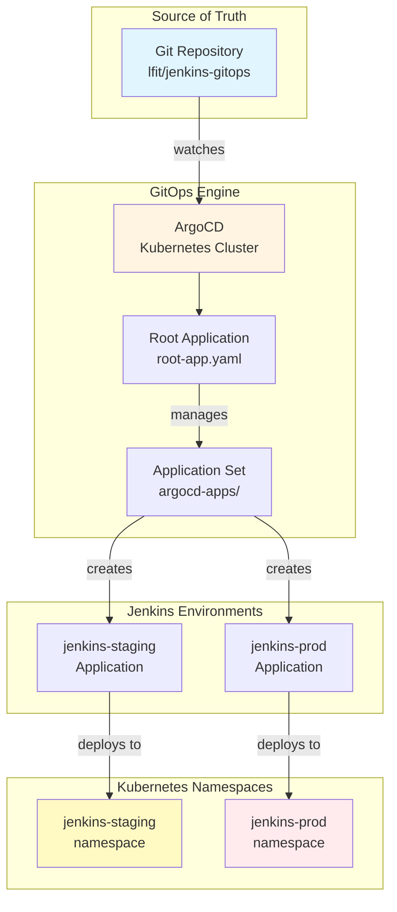
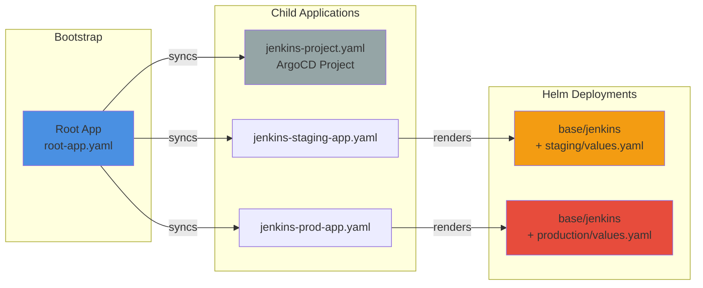
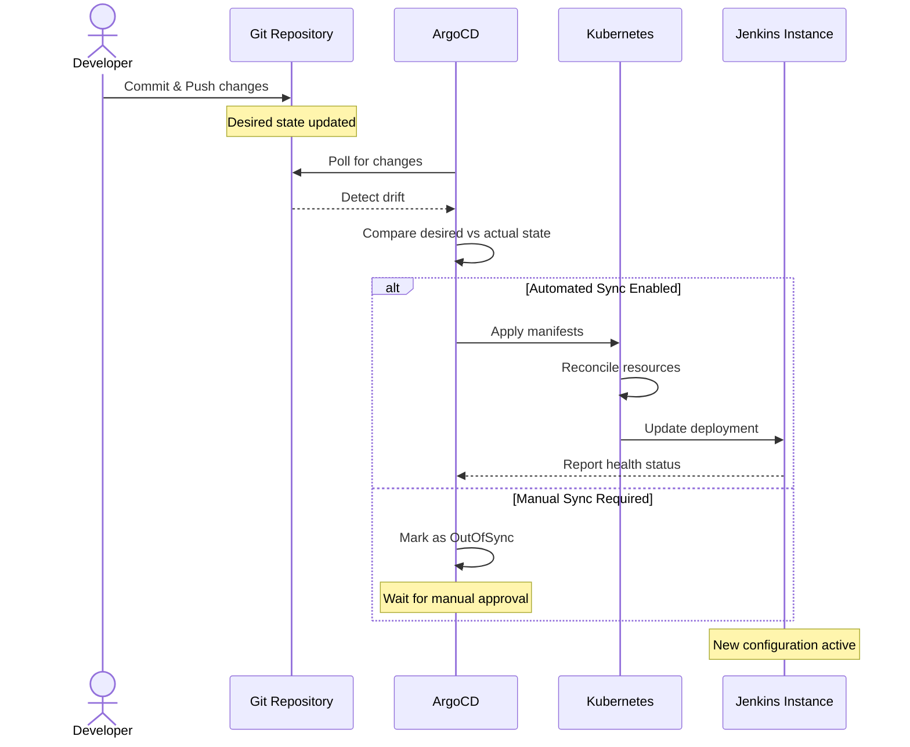
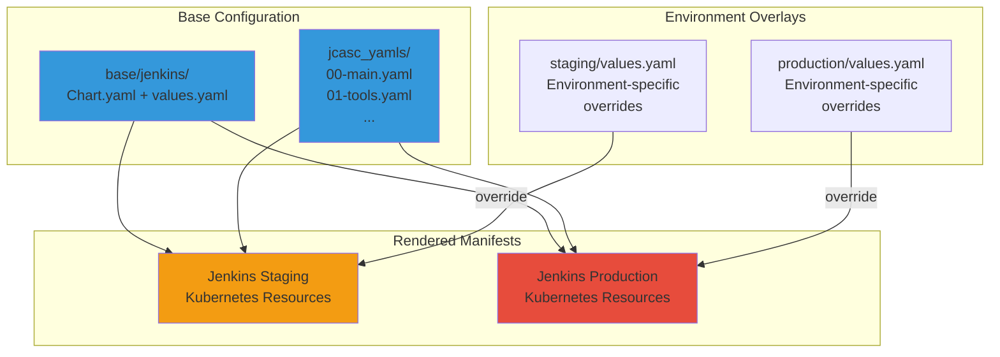

# Architecture

## Overview

This repository implements a GitOps-driven Jenkins deployment on Kubernetes using ArgoCD. It follows the **app-of-apps** pattern to manage multiple Jenkins environments (staging, production) from a single source of truth.

**Key Principles:**
- Git as the single source of truth
- Declarative infrastructure and configuration
- Automated synchronization and reconciliation
- Environment-specific configuration via overlays
- Jenkins Configuration as Code (JCasC) for all Jenkins settings

## High-Level Architecture

### System Overview



### App-of-Apps Pattern



## Repository Structure

```
jenkins-gitops/
├── root-app.yaml              # Root ArgoCD Application (app-of-apps entry)
├── argocd-apps/               # Child Application definitions
│   ├── jenkins-project.yaml   # ArgoCD project configuration
│   ├── jenkins-staging-app.yaml # Staging environment Application
│   └── jenkins-prod-app.yaml    # Production environment Application
├── base/                      # Base configurations (shared)
│   ├── jenkins/               # Jenkins Helm wrapper chart
│   │   ├── Chart.yaml         # Helm chart metadata + dependencies
│   │   ├── values.yaml        # Default Helm values
│   │   ├── jcasc_yamls/       # Jenkins Configuration as Code
│   │   │   ├── 00-main.yaml
│   │   │   ├── 01-tools.yaml
│   │   │   ├── 02-global-libraries.yaml
│   │   │   ├── 03-plugins-config.yaml
│   │   │   ├── 04-credentials.yaml
│   │   │   └── 05-managed-files.yaml
│   │   └── templates/         # Kubernetes resource templates
├── staging/                   # Staging environment overrides
│   └── values.yaml
└── production/                # Production environment overrides
    └── values.yaml
```

## Core Components

### 1. Root Application (`root-app.yaml`)

The entry point for the entire GitOps setup. This is the only Application you need to create manually in ArgoCD.

**Purpose:** Bootstraps the app-of-apps pattern by deploying all child Applications.

**Key Configuration:**
- Points to `argocd-apps/` directory
- Automated sync with prune and self-heal enabled
- Deploys into `argocd` namespace

### 2. Application Set (`argocd-apps/`)

Defines individual ArgoCD Applications for each environment.

**Components:**
- `jenkins-project.yaml` - ArgoCD Project with RBAC and constraints
- `jenkins-staging-app.yaml` - Staging Jenkins instance
- `jenkins-prod-app.yaml` - Production Jenkins instance

**Pattern:** Each Application references:
- Same base path: `base/jenkins`
- Environment-specific values: `{env}/values.yaml`
- Separate namespace: `jenkins-{env}`

### 3. Base Jenkins Chart (`base/jenkins/`)

A **Helm wrapper chart** that pulls the official Jenkins Helm chart as a dependency.

**Chart Dependencies:**

The base chart wraps the official Jenkins Helm chart as a dependency. Version and repository details are defined in `base/jenkins/Chart.yaml`.

**Customizations:**
- JCasC configuration files in `jcasc_yamls/`
- Custom templates in `templates/`
- Base Helm values in `values.yaml`

### 4. JCasC Configuration (`base/jenkins/jcasc_yamls/`)

Jenkins Configuration as Code files that define all Jenkins settings declaratively.

**Configuration Files:**
- `00-main.yaml` - Core Jenkins settings (security, UI, system)
- `01-tools.yaml` - Tool installations (Maven, JDK, etc.)
- `02-global-libraries.yaml` - Shared pipeline libraries
- `03-plugins-config.yaml` - Plugin-specific configurations
- `04-credentials.yaml` - Credential definitions (values from secrets)
- `05-managed-files.yaml` - Managed configuration files

**Pattern:** Environment variables (`JCASC_*`) allow environment-specific values without changing JCasC files.

### 5. Environment Overlays (`staging/`, `production/`)

Environment-specific Helm value overrides.

**Each contains:**
- `values.yaml` - Overrides for controller image, resources, JCasC env vars

**Environment Differences:**

Each environment overrides specific values from the base configuration:

- **Resource Allocation**: Controller CPU, memory, and JVM heap sizes scale from staging to production
- **Storage**: Persistent volume sizes differ per environment needs
- **Image Tags**: Staging uses auto-promoted tags; production uses manually validated tags
- **Agent Types**: Multiple agent types configured per environment
- **Ingress Hostnames**: Environment-specific DNS hostnames configured per deployment
- **JCasC Variables**: Environment-specific URLs, silos, and labels
- **Credentials**: Different admin credentials per environment

**Current values are defined in:**
- `staging/values.yaml` - Staging configuration
- `production/values.yaml` - Production configuration

## Deployment Flow

### Initial Setup

1. **Bootstrap:** Apply `root-app.yaml` to ArgoCD cluster
2. **Discovery:** ArgoCD discovers Applications in `argocd-apps/`
3. **Sync:** ArgoCD creates jenkins-{env} Applications automatically
4. **Deploy:** Each Application deploys Jenkins to its namespace

### Update Flow



**Automatic Sync:** All Applications use `automated` sync policy with:
- `prune: true` - Remove resources deleted from Git
- `selfHeal: true` - Revert manual cluster changes

### Environment Overlay Pattern



## Key Design Patterns

### App-of-Apps Pattern

**Purpose:** Manage multiple related Applications from a single root.

**Benefits:**
- Single entry point for entire system
- Consistent deployment across environments
- Simplified bootstrap process
- Centralized Application lifecycle management

**Implementation:**
- Root Application watches `argocd-apps/`
- Child Applications are themselves ArgoCD resources
- Changes to `argocd-apps/*.yaml` automatically create/update/delete Applications

### Environment Overlay Pattern

**Purpose:** Share common configuration, override only differences.

**Benefits:**
- DRY principle (Don't Repeat Yourself)
- Consistency across environments
- Easy to promote changes through environments
- Clear visibility of environment differences

**Implementation:**
- Base Helm chart in `base/jenkins/`
- Environment values in `{env}/values.yaml`
- Helm's native value merging combines base + overlay

### Configuration as Code (JCasC)

**Purpose:** Declaratively manage all Jenkins configuration.

**Benefits:**
- Version-controlled Jenkins settings
- Reproducible deployments
- No manual UI configuration (reduces drift)
- Easy rollback via Git

**Implementation:**
- JCasC YAML files in `jcasc_yamls/`
- Environment variables inject environment-specific values
- ConfigMaps mount JCasC files into Jenkins container

## Technology Stack

| Component | Technology | Purpose |
|-----------|-----------|---------|
| **GitOps Engine** | ArgoCD | Continuous deployment and sync |
| **Container Orchestration** | Kubernetes | Runtime platform |
| **Package Manager** | Helm | Templating and deployment |
| **Jenkins Chart** | jenkins/jenkins | Official Jenkins Helm chart (version in `base/jenkins/Chart.yaml`) |
| **Configuration** | JCasC | Declarative Jenkins config |
| **Secrets Management** | 1Password Connect | External secrets injection |

## Security Considerations

### Secrets Management

- **Never commit secrets to Git**
- Use external secret operators (1Password Connect, External Secrets Operator)
- Inject secrets as environment variables or mounted volumes
- JCasC credentials reference secret values from environment variables
- Rotate secrets regularly and audit access

### Access Control

- ArgoCD Project constrains allowed repositories and namespaces (see `argocd-apps/jenkins-project.yaml`)
- Kubernetes RBAC controls service account permissions
- Environment namespaces provide workload isolation
- Implement least-privilege access for all service accounts
- Regular access reviews and audit logging

### Network Security

- Environment namespaces provide network isolation boundaries
- Network policies control inter-namespace communication
- Ingress configuration defines external access patterns

### Image Security

- Use specific image tags (never `latest` or mutable tags)
- Implement image scanning in CI/CD pipeline
- Verify image signatures before deployment
- Staging validates images before production promotion
- Maintain inventory of approved base images

### Compliance and Auditing

- All configuration changes tracked in Git history
- ArgoCD provides deployment audit trail
- Review `argocd-apps/jenkins-project.yaml` for project-level security constraints

## Scalability and Extensibility

### Adding New Environments

1. Create new directory: `{env}/values.yaml`
2. Create ArgoCD Application: `argocd-apps/jenkins-{env}-app.yaml`
3. Commit and push - ArgoCD handles the rest

### Adding New Services

1. Create base chart in `base/{service}/`
2. Add environment overlays
3. Create Application definitions in `argocd-apps/`
4. Root Application automatically syncs new Applications

### Customizing Jenkins

**JCasC Changes:**
- Modify files in `base/jenkins/jcasc_yamls/`
- Use `JCASC_*` env vars for environment-specific values

**Plugin Changes:**
- Update `values.yaml` plugin list
- ArgoCD syncs and Jenkins installs automatically

**Chart Updates:**
- Bump dependency version in `Chart.yaml`
- Update `appVersion` for Jenkins version changes

## References

- [ArgoCD Documentation](https://argo-cd.readthedocs.io/)
- [Jenkins Helm Chart](https://github.com/jenkinsci/helm-charts)
- [Jenkins Configuration as Code](https://github.com/jenkinsci/configuration-as-code-plugin)
- [GitOps Principles](https://opengitops.dev/)
