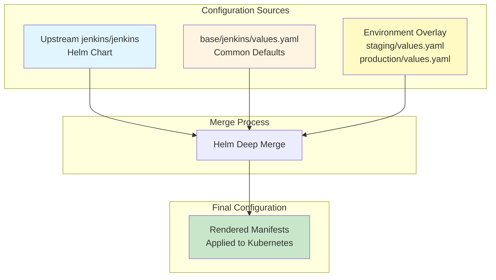
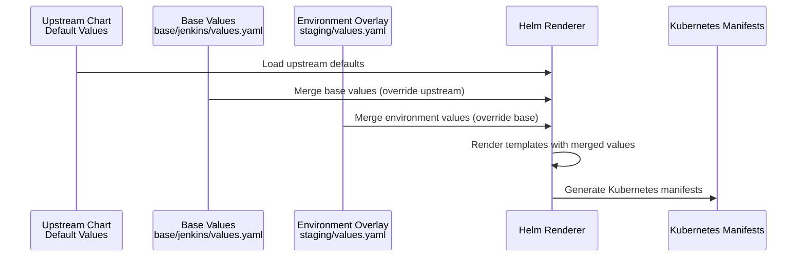
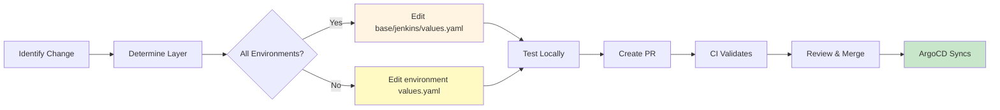

# Configuration

## Overview

This document explains the configuration system for jenkins-gitops, with emphasis on the **configuration hierarchy** and how values are merged from base to environment-specific overlays. Understanding this hierarchy is critical for making configuration changes correctly.

**Key Concepts:**
- Base configuration defines common defaults
- Environment overlays selectively override base values
- Helm merges configurations using deep merge semantics
- JCasC embeds Jenkins configuration within Helm values
- Environment variables inject environment-specific values into JCasC templates

## Configuration Hierarchy

The configuration system uses a **base-plus-overlays** pattern. This eliminates duplication while maintaining environment isolation.



### Hierarchy Layers

Configuration flows through three layers, each overriding the previous:

| Layer | Location | Purpose | Precedence |
|-------|----------|---------|------------|
| **Upstream Chart** | `jenkins/jenkins` Helm chart | Default values from official Jenkins chart | Lowest |
| **Base Values** | `base/jenkins/values.yaml` | Common defaults shared across all environments | Middle |
| **Environment Overlay** | `staging/values.yaml`<br/>`production/values.yaml` | Environment-specific overrides | Highest |

**Precedence Rule:** Environment overlay values override base values, which override upstream chart defaults.

## Base Configuration Layer

The base configuration (`base/jenkins/values.yaml`) establishes defaults shared across all environments.

**What Base Configuration Defines:**

```yaml
# Container image defaults
jenkins:
  controller:
    image:
      registry: "ghcr.io"
      repository: "lfit/jenkins"
      # tag intentionally omitted - controlled per environment

# GitHub integration (shared across environments)
jenkins:
  controller:
    containerEnv:
      - name: JCASC_GITHUB_API_URL
        value: "https://api.github.com"
      - name: JCASC_GITHUB_CREDENTIALS_ID
        value: "github-token"

# JCasC configuration
jenkins:
  controller:
    JCasC:
      defaultConfig: false  # Disable upstream defaults

# Storage configuration
persistence:
  enabled: true
  storageClass: "auto-ebs-sc"
  # size controlled per environment
```

**Base Layer Characteristics:**
- Defines structure and common values
- Does NOT specify environment-specific values (image tags, resource limits, URLs)
- Provides defaults that work for all environments
- References environment variables for values that differ per environment

**Reference:** `base/jenkins/values.yaml`

## Environment Overlay Layer

Environment overlays (`staging/values.yaml`, `production/values.yaml`) override base values for environment-specific needs.

### How Overlays Work

Overlays use Helm's deep merge behavior:
- **Scalar values** (strings, numbers): Environment value replaces base value
- **Objects** (maps): Keys are merged; environment values override matching base keys
- **Arrays** (lists): Environment array replaces entire base array (no merging)

### Common Override Patterns

#### Pattern 1: Override Scalar Values

**Base:**
```yaml
jenkins:
  controller:
    image:
      registry: "ghcr.io"
      repository: "lfit/jenkins"
```

**Environment Overlay:**
```yaml
jenkins:
  controller:
    image:
      tag: "main-2b06ad4"
      pullPolicy: "IfNotPresent"
```

**Result:** Environment adds `tag` and `pullPolicy` to base `registry` and `repository`.

#### Pattern 2: Override Nested Objects

**Base:**
```yaml
persistence:
  enabled: true
  storageClass: "auto-ebs-sc"
```

**Environment Overlay:**
```yaml
persistence:
  size: "20Gi"
```

**Result:** Environment adds `size` while keeping base `enabled` and `storageClass`.

#### Pattern 3: Replace Arrays Completely

**Base:**
```yaml
jenkins:
  controller:
    containerEnv:
      - name: JCASC_GITHUB_API_URL
        value: "https://api.github.com"
```

**Environment Overlay:**
```yaml
jenkins:
  controller:
    containerEnv:
      - name: JCASC_GITHUB_API_URL
        value: "https://api.github.com"
      - name: JCASC_JENKINS_URL
        value: "https://jenkins-staging.example.com"
      - name: JCASC_SILO
        value: "staging"
```

**Result:** Environment array **completely replaces** base array. You must repeat base values if you want to keep them.

**Important:** Arrays do NOT merge! The environment array replaces the base array entirely. This is Helm's default behavior.

### Environment-Specific Overrides

Each environment overrides different aspects of the base configuration:

| Configuration Aspect | Base | Staging Override | Production Override |
|---------------------|------|------------------|---------------------|
| **Image Tag** | Not specified | Specific commit SHA | Validated commit SHA |
| **Resource Requests** | Not specified | Environment-specific values | Environment-specific values |
| **Resource Limits** | Not specified | Environment-specific values | Environment-specific values |
| **JVM Heap Size** | Not specified | Environment-specific values | Environment-specific values |
| **Storage Size** | Not specified | Environment-specific values | Environment-specific values |
| **Environment Variables** | Common only | Staging-specific URLs/values | Production-specific URLs/values |
| **IAM Role** | Not specified | Staging IRSA role ARN | Production IRSA role ARN |
| **Permissions** | Not specified | Extended to maintainers | Restricted to LF teams |

**Reference:** `staging/values.yaml`, `production/values.yaml`

## JCasC Integration

Jenkins Configuration as Code (JCasC) is embedded directly within Helm values files, allowing GitOps management of all Jenkins settings.

### JCasC Structure in Helm Values

JCasC configuration lives in the `jenkins.controller.JCasC.configScripts` section:

```yaml
jenkins:
  controller:
    JCasC:
      defaultConfig: false  # Disable upstream defaults
      configScripts:
        jenkins-config: |
          jenkins:
            securityRealm: ...
            authorizationStrategy: ...
            clouds: ...

        credentials-config: |
          credentials:
            system:
              domainCredentials: ...

        unclassified-config: |
          unclassified:
            githubPluginConfig: ...

        tool-config: |
          tool:
            git: ...
            jdk: ...
```

Each `configScripts` key becomes a separate ConfigMap in Kubernetes, which Jenkins loads at startup.

### Multiple Root Keys Pattern

JCasC uses the **multiple root keys pattern** to organize configuration by type:

| Root Key | Purpose | Configuration Types |
|----------|---------|---------------------|
| `jenkins-config` | Core Jenkins settings | Security realm, authorization, clouds, global properties |
| `credentials-config` | Credential definitions | GitHub tokens, SSH keys, AWS credentials |
| `unclassified-config` | Plugin configurations | GitHub plugin, GHPRB, email settings |
| `tool-config` | Tool installations | Git, JDK, Maven, other build tools |

**Benefits:**
- Prevents YAML merge conflicts
- Organizes configuration logically
- Follows official JCasC plugin documentation

**Reference:** [JCasC Plugin Documentation](https://github.com/jenkinsci/configuration-as-code-plugin)

### JCasC in Base vs Environment Overlays

**Base Layer:**
- Does NOT contain JCasC configuration
- Only configures `JCasC.defaultConfig: false`

**Environment Overlays:**
- Contain full JCasC configuration in `configScripts`
- Each environment defines its own complete JCasC configuration

**How configScripts Merging Works:**

The `configScripts` field is a map/object where each key represents a separate JCasC configuration block:

```yaml
JCasC:
  configScripts:
    jenkins-config: |      # Key 1 - contains YAML as string
      jenkins: ...
    credentials-config: |  # Key 2 - contains YAML as string
      credentials: ...
```

**Merge Behavior:**
- `configScripts` **keys merge** (it's an object, not an array)
- Each key's **content replaces entirely** (it's a YAML string, not structured data)
- In current setup: Base has no `configScripts`, so environment overlay defines all keys

**Practical Impact:** Since the base layer has no JCasC configuration, each environment must define all needed `configScripts` keys (jenkins-config, credentials-config, etc.). You cannot inherit JCasC configuration from base because there is none to inherit.

## Configuration Organization

### Directory Structure

```
jenkins-gitops/
├── base/jenkins/
│   ├── Chart.yaml              # Helm chart metadata and dependencies
│   ├── values.yaml             # Base values (common defaults)
│   ├── jcasc_yamls/            # (Legacy - not used in current setup)
│   └── templates/              # Kubernetes resource templates
├── staging/
│   └── values.yaml             # Staging overrides + full JCasC config
└── production/
    └── values.yaml             # Production overrides + full JCasC config
```

### Chart Dependencies

The base chart wraps the official Jenkins Helm chart as a dependency:

```yaml
# base/jenkins/Chart.yaml
dependencies:
  - name: jenkins
    version: 5.8.68
    repository: https://charts.jenkins.io
```

All configuration in `base/jenkins/values.yaml` and environment overlays is passed to this upstream chart.

**Reference:** `base/jenkins/Chart.yaml`

## Environment Variables Pattern

JCasC templates use environment variable substitution to inject environment-specific values without duplicating YAML.

### How Environment Variables Work

**1. Define Environment Variables in Helm Values:**

```yaml
jenkins:
  controller:
    containerEnv:
      - name: JCASC_JENKINS_URL
        value: "https://jenkins-staging.example.com"
      - name: JCASC_SILO
        value: "staging"
      - name: SAML_METADATA_URL
        valueFrom:
          secretKeyRef:
            name: jenkins-secrets
            key: saml-metadata-url
```

**2. Reference Variables in JCasC Configuration:**

```yaml
jenkins:
  controller:
    JCasC:
      configScripts:
        jenkins-config: |
          jenkins:
            globalNodeProperties:
              - envVars:
                  env:
                    - key: "JENKINS_URL"
                      value: '${JCASC_JENKINS_URL}'
                    - key: "CI_ENVIRONMENT"
                      value: '${JCASC_SILO}'

            securityRealm:
              saml:
                idpMetadataConfiguration:
                  url: "${SAML_METADATA_URL}"
```

**3. Jenkins Resolves Variables at Startup:**

JCasC plugin replaces `${VAR_NAME}` with actual environment variable values when Jenkins starts.

### Variable Naming Convention

| Prefix | Purpose | Example |
|--------|---------|---------|
| `JCASC_*` | JCasC template variables | `JCASC_JENKINS_URL`, `JCASC_SILO` |
| `SAML_*` | SAML/SSO configuration | `SAML_METADATA_URL`, `SAML_LOGOUT_URL` |
| (no prefix) | Standard environment variables | `AWS_REGION`, `LANG` |

### Benefits of Environment Variables

- **DRY Configuration:** Define values once, reference many times
- **Environment Isolation:** Same JCasC template works for all environments
- **Secret Management:** Variables can reference Kubernetes Secrets
- **Validation:** Helm validates variable references at render time

## Helm Value Merging Process

Understanding how Helm merges values is critical for predicting final configuration.

### Merge Order



### Merge Rules by Type

| Value Type | Merge Behavior | Example |
|-----------|----------------|---------|
| **Scalar** (string, number, boolean) | Environment value replaces base value | `tag: "main-123"` replaces base |
| **Object** (map/dictionary) | Deep merge - keys combined, conflicts favor environment | `image: {registry: "ghcr.io"}` + `image: {tag: "v1"}` → `image: {registry: "ghcr.io", tag: "v1"}` |
| **Array** (list) | Environment array **replaces** base array (no merge) | Environment `[A, B, C]` replaces base `[X, Y]` |
| **Null** | Explicitly removes base value | `installPlugins: null` removes base value |

### Array Merging Gotcha

**Arrays do NOT merge!** This is the most common source of configuration errors.

**Example - Incorrect:**

Base:
```yaml
jenkins:
  controller:
    containerEnv:
      - name: VAR_A
        value: "value-a"
```

Environment (trying to add one variable):
```yaml
jenkins:
  controller:
    containerEnv:
      - name: VAR_B
        value: "value-b"
```

**Result:** Only `VAR_B` exists. `VAR_A` is lost!

**Example - Correct:**

Environment (must repeat all variables):
```yaml
jenkins:
  controller:
    containerEnv:
      - name: VAR_A
        value: "value-a"
      - name: VAR_B
        value: "value-b"
```

**Result:** Both `VAR_A` and `VAR_B` exist.

### Testing Value Merging

To see the final merged configuration before deploying:

```bash
# Render Helm templates with environment values
helm template jenkins ./base/jenkins \
  -f ./staging/values.yaml \
  --debug

# View specific value in final configuration
helm template jenkins ./base/jenkins \
  -f ./staging/values.yaml \
  --debug | grep -A 10 "containerEnv"
```

## Making Configuration Changes

### Workflow for Configuration Changes



### Decision Matrix: Where to Make Changes

| Change Type | Edit Location | Reason |
|------------|---------------|--------|
| Common default for all environments | `base/jenkins/values.yaml` | Shared configuration |
| Environment-specific value | `staging/values.yaml` or `production/values.yaml` | Environment isolation |
| JCasC configuration | Environment `values.yaml` | JCasC not in base layer |
| Image tag update | Environment `values.yaml` | Different tags per environment |
| Resource limits | Environment `values.yaml` | Resources differ per environment |
| Credentials | Environment `values.yaml` (via env vars) | Environment-specific secrets |

### Common Change Patterns

#### Change 1: Update Image Tag

**File:** `staging/values.yaml` or `production/values.yaml`

```yaml
jenkins:
  controller:
    image:
      tag: "main-abc1234"  # Update this value
```

**ArgoCD Effect:** Triggers pod restart with new image.

#### Change 2: Modify Resource Limits

**File:** Environment `values.yaml`

```yaml
jenkins:
  controller:
    resources:
      requests:
        cpu: "2000m"      # Increase CPU request
        memory: "4Gi"     # Increase memory request
      limits:
        cpu: "4000m"      # Increase CPU limit
        memory: "8Gi"     # Increase memory limit
```

**ArgoCD Effect:** Triggers pod restart with new resource allocation.

#### Change 3: Add Environment Variable

**File:** Environment `values.yaml`

```yaml
jenkins:
  controller:
    containerEnv:
      # Copy all existing variables
      - name: EXISTING_VAR
        value: "existing-value"
      # Add new variable
      - name: NEW_VAR
        value: "new-value"
```

**Important:** Must include all existing variables (arrays don't merge).

#### Change 4: Update JCasC Configuration

**File:** Environment `values.yaml`

```yaml
jenkins:
  controller:
    JCasC:
      configScripts:
        jenkins-config: |
          jenkins:
            # Modify JCasC configuration here
            globalNodeProperties:
              - envVars:
                  env:
                    - key: "NEW_SETTING"
                      value: "new-value"
```

**ArgoCD Effect:** Updates ConfigMap, triggers Jenkins configuration reload.

### Validation Before Deployment

**1. Helm Syntax Validation:**

```bash
helm lint ./base/jenkins -f ./staging/values.yaml
```

**2. Render Templates:**

```bash
helm template jenkins ./base/jenkins -f ./staging/values.yaml
```

**3. Validate Against Kubernetes:**

```bash
helm template jenkins ./base/jenkins -f ./staging/values.yaml | kubectl apply --dry-run=client -f -
```

**4. CI/CD Validation:**

All pull requests automatically run:
- Helm linting
- YAML validation
- Security scanning
- ArgoCD manifest validation

**Reference:** `.github/workflows/helm-validate.yaml`

## Troubleshooting Configuration Issues

### Common Issues and Solutions

| Issue | Symptom | Solution |
|-------|---------|----------|
| **Environment variable not applied** | JCasC shows literal `${VAR_NAME}` | Verify variable defined in `containerEnv` list |
| **Array values missing** | Expected values don't appear in pod | Remember: arrays don't merge. Include all values in environment overlay |
| **Changes not applied** | ArgoCD shows synced but old config active | Check if ConfigMap was updated. May need manual pod restart |
| **Resource limits ignored** | Pod uses wrong resources | Verify environment overlay has correct precedence in ArgoCD Application |
| **JCasC validation error** | Jenkins fails to start | Check JCasC syntax with Jenkins Config-as-Code validator |

### Debugging Configuration Merging

**View final merged values in ArgoCD:**

1. Navigate to Application in ArgoCD UI
2. Click "App Details" → "Parameters"
3. View resolved Helm values

**View rendered manifests locally:**

```bash
helm template jenkins ./base/jenkins \
  -f ./staging/values.yaml \
  --debug > /tmp/rendered.yaml

# Inspect specific resources
grep -A 50 "kind: ConfigMap" /tmp/rendered.yaml
```

**Verify ConfigMap in cluster:**

```bash
kubectl get configmap jenkins-jenkins-jenkins-config \
  -n jenkins-staging \
  -o yaml
```

## Best Practices

1. **Keep Base Minimal:** Only include truly common configuration in base layer
2. **Document Overrides:** Comment environment values that override base
3. **Test Locally:** Always render templates locally before pushing
4. **Validate JCasC:** Use JCasC validator before deploying changes
5. **Array Awareness:** Remember arrays replace (don't merge) - include all values
6. **Environment Variables:** Use variables for values that differ per environment
7. **Incremental Changes:** Make small, testable changes rather than large rewrites
8. **Version Control:** Commit Chart.lock after dependency updates

## References

- [Helm Values Documentation](https://helm.sh/docs/chart_template_guide/values_files/)
- [Jenkins Configuration as Code Plugin](https://github.com/jenkinsci/configuration-as-code-plugin)
- [Kubernetes ConfigMap Documentation](https://kubernetes.io/docs/concepts/configuration/configmap/)
- [ArgoCD App of Apps Pattern](https://argo-cd.readthedocs.io/en/stable/operator-manual/cluster-bootstrapping/)
