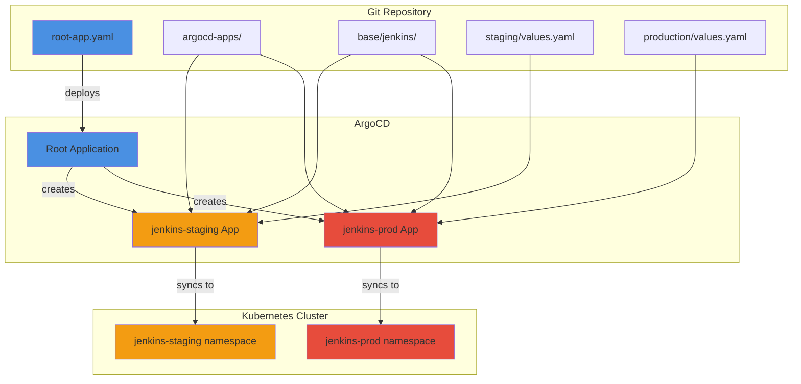
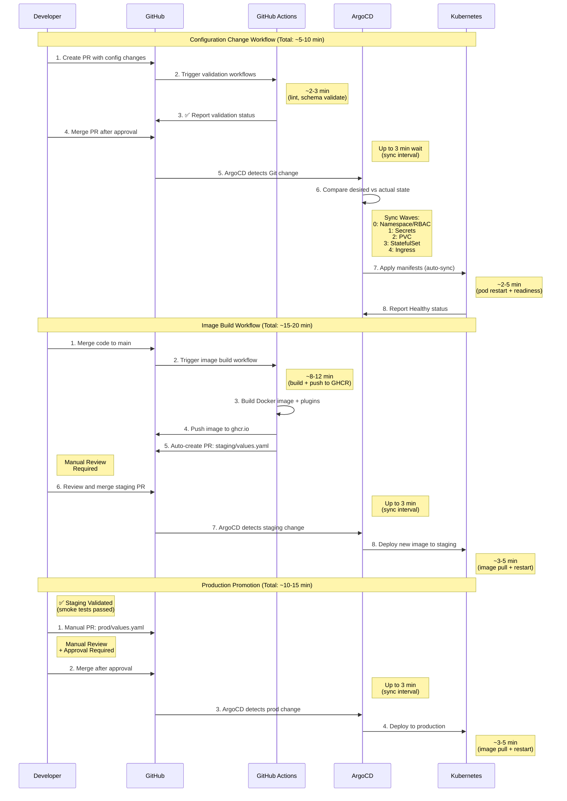

# Deployment

## Table of Contents

- [Overview](#overview)
- [GitOps Principles](#gitops-principles)
- [Quick Operations Reference](#quick-operations-reference)
- [Read-Only Operations](#read-only-operations)
- [Prerequisites](#prerequisites)
- [Architecture Overview](#architecture-overview)
- [Initial Bootstrap](#initial-bootstrap)
- [Deployment Workflows](#deployment-workflows)
- [Monitoring Deployments](#monitoring-deployments)
- [Rollback Procedures](#rollback-procedures)
- [Common Operations](#common-operations)
- [Troubleshooting](#troubleshooting)
- [Security Best Practices](#security-best-practices)
- [GitOps Compliance Check](#gitops-compliance-check)
- [Reference](#reference)
- [Best Practices](#best-practices)
- [Additional Resources](#additional-resources)
- [Emergency Access](#emergency-access)

[↑ Back to top](#table-of-contents)

## Overview

This guide provides comprehensive deployment procedures for the jenkins-gitops system. It covers initial setup, day-to-day operations, image promotion workflows, and troubleshooting strategies.

**Relevant source files:**
- `root-app.yaml` - ArgoCD bootstrap entry point
- `argocd-apps/jenkins-staging-app.yaml` - Staging Application manifest
- `argocd-apps/jenkins-prod-app.yaml` - Production Application manifest
- `.github/workflows/build-jenkins-image.yml` - Image build automation
- `.github/workflows/deploy-staging-environment.yml` - Staging promotion automation
- `staging/values.yaml` - Staging environment configuration
- `production/values.yaml` - Production environment configuration

**Target audience:**
- Release Engineers deploying and managing Jenkins infrastructure
- SRE teams responsible for Jenkins operations
- Platform teams migrating to GitOps-based Jenkins

**What this guide covers:**
- Initial ArgoCD bootstrap and setup
- Configuration change workflows
- Image build and promotion processes
- Monitoring deployment status
- Rollback procedures
- Common operational tasks
- Troubleshooting deployment issues

For architectural details, see [Architecture](ARCHITECTURE.md). For configuration patterns, see [Configuration](CONFIGURATION.md).

[↑ Back to top](#table-of-contents)

## GitOps Principles

### How GitOps Works

This system follows GitOps principles where **Git is the single source of truth** for infrastructure and application configuration.

**Reconciliation Loop:**
- ArgoCD continuously monitors Git repository (default: every 3 minutes)
- Compares desired state (Git) vs. actual state (Kubernetes cluster)
- Automatically applies changes when drift detected (if auto-sync enabled)
- Reports health status back to ArgoCD UI/API

**Drift Detection:**
- Manual cluster changes (e.g., `kubectl edit`) are detected as "OutOfSync"
- Self-healing automatically reverts manual changes within sync interval
- Drift alerts can trigger notifications to prevent unauthorized changes

**Observability:**
- Changes appear in cluster within **3 minutes** of Git commit (sync interval)
- Manual sync with `argocd app sync` applies changes immediately
- Sync waves control resource creation order (see Architecture section)
- Rollout status tracked via ArgoCD health checks

**Audit Trail:**
- Every change requires Git commit (who, what, when, why)
- PR reviews provide approval workflow
- ArgoCD sync history maintains deployment timeline
- Rollbacks use Git revert for full audit trail

⚠️ **Important:** Avoid manual `kubectl` commands for changes. Use only for:
- Read-only operations (get, describe, logs)
- Emergency troubleshooting (with immediate Git reconciliation)
- Debugging (followed by GitOps fix)

[↑ Back to top](#table-of-contents)

## Quick Operations Reference

**Need immediate help?** Use these fast-access commands for common urgent tasks.

> ⚠️ **Prerequisites:** Understand [GitOps Principles](#gitops-principles) and [Architecture Overview](#architecture-overview) before running these commands. Improper use can violate GitOps workflows or cause drift between Git and cluster state.

### Emergency Rollback

```bash
# Staging rollback (ArgoCD)
argocd app rollback jenkins-staging $(argocd app history jenkins-staging -o json | jq -r '.[1].id')

# Production rollback (ArgoCD)
argocd app rollback jenkins-prod $(argocd app history jenkins-prod -o json | jq -r '.[1].id')
```

### Check Deployment Status

```bash
# Quick health check (staging)
kubectl get pods -n jenkins-staging && argocd app get jenkins-apps --refresh

# Quick health check (production)
kubectl get pods -n jenkins-prod && argocd app get jenkins-apps --refresh

# View recent errors
kubectl logs jenkins-0 -n jenkins-staging -c jenkins --tail=50 | grep -i error
```

### Access Jenkins

**Primary Access Method (SSO):**

Jenkins uses SAML SSO via Linux Foundation identity provider:

- **Staging:** `https://jenkins-stag.opensearch.cluster.linuxfound.info`
- **Production:** `https://jenkins.opensearch.cluster.linuxfound.info`

**Authentication:**
1. Navigate to Jenkins URL
2. Click "Login with SAML"
3. Authenticate via LF SSO
4. Groups mapped automatically (`lf-releng`, `lf-sysops` for admin)

**Emergency Admin Access:**

See [Emergency Access](#emergency-access) section only if:
- SSO is completely unavailable
- You've escalated to Security team
- Incident is documented

### Force Sync Operations

```bash
# Force ArgoCD sync (staging)
argocd app sync jenkins-staging --force

# Force secret refresh (example for github token)
# Actual ExternalSecret names vary by secret type
kubectl annotate externalsecret opensearch-jenkins-github-token -n jenkins-staging \
  force-sync="$(date +%s)" --overwrite

# Restart Jenkins pod
kubectl rollout restart statefulset/jenkins -n jenkins-staging
```

### When to Escalate

**Escalate immediately to CloudOps if:**
- ArgoCD itself is unavailable or unhealthy
- Cluster nodes are unavailable or unresponsive
- Persistent volumes failing to mount across all namespaces
- Network policies blocking all traffic cluster-wide
- RBAC/permissions issues preventing ArgoCD operations
- Production rollback doesn't resolve critical issue

**Escalate to Release Engineering lead if:**
- Single deployment failure with clear error message
- Configuration drift detected by ArgoCD
- Secrets not syncing from 1Password
- Jenkins plugins failing to install
- JCasC configuration validation errors

[↑ Back to top](#table-of-contents)

---

## Read-Only Operations

**Purpose:** Safe cluster inspection commands for troubleshooting and monitoring that do NOT modify resources or violate GitOps principles.

### Approved kubectl Commands

**Cluster Inspection:**
```bash
# View pod status and events
kubectl get pods -n jenkins-staging
kubectl get pods -n jenkins-prod --watch

# Describe resources (includes events and configuration)
kubectl describe pod jenkins-0 -n jenkins-staging
kubectl describe statefulset jenkins -n jenkins-prod
kubectl describe ingress jenkins -n jenkins-staging

# View resource logs
kubectl logs jenkins-0 -n jenkins-staging -c jenkins --tail=100
kubectl logs jenkins-0 -n jenkins-prod -c jenkins --follow
kubectl logs -l app.kubernetes.io/name=jenkins -n jenkins-staging --prefix

# Check resource health
kubectl get events -n jenkins-staging --sort-by='.lastTimestamp'
kubectl top pods -n jenkins-staging  # Resource usage
kubectl top nodes  # Cluster capacity
```

**ArgoCD Inspection:**
```bash
# Application status and sync state
argocd app get jenkins-staging
argocd app get jenkins-prod --refresh

# Deployment history
argocd app history jenkins-staging
argocd app history jenkins-prod

# Diff between Git and cluster
argocd app diff jenkins-staging
argocd app diff jenkins-prod

# List all applications
argocd app list -o wide
```

**ExternalSecrets Inspection:**
```bash
# Check ExternalSecret sync status
kubectl get externalsecrets -n jenkins-staging
kubectl describe externalsecret opensearch-jenkins-github-token -n jenkins-staging

# View SecretStore health
kubectl get secretstore -n jenkins-staging
kubectl describe secretstore onepassword-releng -n jenkins-staging
```

### 🚨 Anti-Patterns to AVOID

**NEVER use these patterns** — they violate GitOps and create untracked drift:

```bash
# ❌ WRONG: Export-modify-apply pattern
kubectl get deployment jenkins -n jenkins-staging -o yaml > temp.yaml
# ... edit temp.yaml ...
kubectl apply -f temp.yaml  # Creates drift!

# ❌ WRONG: Direct resource editing
kubectl edit statefulset jenkins -n jenkins-staging  # Bypasses Git!

# ❌ WRONG: Imperative scaling
kubectl scale statefulset jenkins --replicas=2 -n jenkins-staging  # Not in Git!

# ❌ WRONG: Direct secret creation
kubectl create secret generic my-secret --from-literal=key=value  # Not in 1Password!
```

**Why These Are Dangerous:**
- Changes NOT recorded in Git (no audit trail)
- ArgoCD detects "OutOfSync" and may auto-revert (self-healing enabled)
- Next Git sync overwrites manual changes (data loss)
- Violates compliance and security requirements

**Correct Approach:**
1. Make changes in Git repository (`staging/values.yaml`, `production/values.yaml`)
2. Commit and push to GitHub
3. ArgoCD syncs automatically within 3 minutes
4. Verify with read-only commands above

### When Read-Only Is Not Enough

If you need to make changes:
- **Configuration:** Edit Helm values in Git → commit → push → wait for ArgoCD sync
- **Secrets:** Update in 1Password → annotate ExternalSecret to force refresh
- **Emergency:** See [Emergency Access](#emergency-access) section with mandatory incident documentation

---

### Escalation Guidelines

**Escalate immediately to CloudOps if:**
- ArgoCD itself is unavailable or unhealthy
- Cluster nodes are unavailable or unresponsive
- Persistent volumes failing to mount across all namespaces
- Network policies blocking all traffic cluster-wide
- RBAC/permissions issues preventing ArgoCD operations
- Certificate or authentication issues at cluster level

**Escalate to Release Engineering Lead if:**
- Production rollback doesn't resolve critical issue
- Multiple staging deployments failing consecutively
- Suspected security vulnerability in Jenkins or plugins
- Data corruption detected in Jenkins home directory
- Need emergency production deployment outside change window

**Handle within team if:**
- Single deployment failure with clear error message
- JCasC configuration syntax errors
- Plugin compatibility issues
- Resource limit adjustments needed
- Standard rollback procedures applicable

[↑ Back to top](#table-of-contents)

## Prerequisites

Before deploying jenkins-gitops, ensure you have:

**Infrastructure Requirements:**
- Kubernetes cluster (1.23+) with kubectl access
- ArgoCD installed and accessible (2.8+)
- External Secrets Operator configured with 1Password integration
- Container registry access (GitHub Container Registry)
- Persistent volume provisioner (for Jenkins home directory)
- IAM roles for service accounts (IRSA) for AWS integration (CloudOps-managed)

**Access Requirements:**
- GitHub repository access to `lfit/jenkins-gitops`
- ArgoCD admin or project-level permissions
- Kubernetes namespace admin permissions for `jenkins-staging` and `jenkins-prod`
- Container registry push/pull permissions

**Local Tools:**
- `kubectl` (1.23+)
- `argocd` CLI (2.8+)
- `helm` (3.12+)
- `git`

**Knowledge Requirements:**
- Basic Kubernetes concepts (Deployments, Services, ConfigMaps, Secrets)
- ArgoCD fundamentals (Applications, Projects, sync policies)
- Helm chart templating and value overrides
- Jenkins Configuration as Code (JCasC) basics

[↑ Back to top](#table-of-contents)

## Architecture Overview

The jenkins-gitops system uses the **app-of-apps pattern** to manage two independent Jenkins environments:



**Key concepts:**
- **Root Application** (`root-app.yaml`) is the single entry point that manages all child Applications
- **Child Applications** (`argocd-apps/*.yaml`) define environment-specific deployments
- **Base configuration** (`base/jenkins/`) provides shared Helm chart and JCasC templates
- **Environment overlays** (`staging/`, `production/`) override specific values per environment
- **Automated sync** ensures Git state automatically propagates to clusters

**Sync Waves and Resource Ordering:**
- **Wave 0** (default): Namespace, RBAC, ServiceAccounts
- **Wave 1**: ConfigMaps, Secrets (ExternalSecrets)
- **Wave 2**: PersistentVolumeClaims
- **Wave 3**: Services, StatefulSets
- **Wave 4**: Ingress
- Resources within a wave sync in parallel
- ArgoCD waits for wave to be healthy before starting next wave

**Namespace Lifecycle:**
- Namespaces created automatically by ArgoCD Application `syncOptions: ["CreateNamespace=true"]`
- Managed by ArgoCD root application
- Deletion requires manual removal from ArgoCD (safety measure)
- Labels applied: `managed-by: argocd`, `environment: staging|production`

[↑ Back to top](#table-of-contents)

## Initial Bootstrap

### First-Time Setup

Bootstrap the jenkins-gitops system by deploying the root Application to ArgoCD. This is a **one-time operation** that creates the app-of-apps structure.

**Step 1: Verify Prerequisites**

```bash
# Verify cluster access
kubectl cluster-info

# Verify ArgoCD is running
kubectl get pods -n argocd

# Verify ArgoCD CLI authentication
argocd account get-user-info
```

**Step 2: Create ArgoCD Project**

The `jenkins` ArgoCD Project defines security boundaries and resource constraints:

```bash
# Apply the jenkins project (must exist before Applications)
kubectl apply -f argocd-apps/jenkins-project.yaml
```

This creates a Project with:
- Allowed source repositories: `https://github.com/lfit/jenkins-gitops`
- Permitted namespaces: `jenkins-staging`, `jenkins-prod`
- Resource whitelist: Namespace creation (cluster-scoped), all resources within namespaces

**Reference:** `argocd-apps/jenkins-project.yaml`

**Step 3: Deploy Root Application**

Deploy the root Application that bootstraps the entire system:

```bash
# Apply root application
kubectl apply -f root-app.yaml

# Verify root application is healthy
argocd app get jenkins-apps
```

The root Application watches the `argocd-apps/` directory and automatically creates child Applications for staging and production environments.

**Expected output:**
```
Name:               jenkins-apps
Project:            jenkins
Server:             https://kubernetes.default.svc
Namespace:          argocd
URL:                https://argocd.example.com/applications/jenkins-apps
Source:
- Repo:             https://github.com/lfit/jenkins-gitops
  Target:           main
  Path:             argocd-apps
Sync Policy:        Automated (Prune)
Sync Status:        Synced to main (abc1234)
Health Status:      Healthy
```

**Step 4: Verify Child Applications**

The root Application automatically creates child Applications:

```bash
# List all jenkins Applications
argocd app list | grep jenkins

# Check staging application
argocd app get jenkins-staging

# Check production application
argocd app get jenkins-prod
```

**Expected Applications:**
- `jenkins-staging` - Deploys to `jenkins-staging` namespace
- `jenkins-prod` - Deploys to `jenkins-prod` namespace

**Step 5: Initial Sync**

ArgoCD automatically syncs Applications due to the automated sync policy. Monitor the sync progress:

```bash
# Watch staging deployment
argocd app sync jenkins-staging --async
argocd app wait jenkins-staging --timeout 600

# Watch production deployment
argocd app sync jenkins-prod --async
argocd app wait jenkins-prod --timeout 600

# View sync status
kubectl get pods -n jenkins-staging
kubectl get pods -n jenkins-prod
```

#### Step 6: Verify Jenkins Access

Once deployments are healthy, verify Jenkins is accessible:

```bash
# Get staging ingress
kubectl get ingress -n jenkins-staging

# Get production ingress
kubectl get ingress -n jenkins-prod
```

**Access Jenkins via SSO:**
- Staging: `https://jenkins-stag.opensearch.cluster.linuxfound.info`
- Production: `https://jenkins.opensearch.cluster.linuxfound.info`

### Bootstrap Verification Checklist

Confirm successful bootstrap by checking:

- [ ] ArgoCD Project `jenkins` exists
- [ ] Root Application `jenkins-apps` is Synced and Healthy
- [ ] Child Application `jenkins-staging` is Synced and Healthy
- [ ] Child Application `jenkins-prod` is Synced and Healthy
- [ ] Namespaces `jenkins-staging` and `jenkins-prod` exist
- [ ] Jenkins controller pods are Running in both namespaces
- [ ] Jenkins StatefulSets have 1/1 ready replicas
- [ ] Ingress resources exist and have addresses
- [ ] Jenkins UI is accessible via browser
- [ ] Jenkins admin credentials work for login

[↑ Back to top](#table-of-contents)

## Deployment Workflows

### GitOps Change Flow

All changes follow the GitOps principle: **Git is the single source of truth**. The deployment flow varies by change type:



**Key Timing Notes:**
- **ArgoCD Sync Interval:** 3 minutes (configurable)
- **Automated Deployments:** Staging only (post-build)
- **Manual Gates:** Staging PR review, Production promotion
- **Total Time (Config Change):** 5-10 minutes PR merge → deployed
- **Total Time (Image Build → Staging):** 15-20 minutes
- **Total Time (Staging → Production):** 10-15 minutes (after validation)

[↑ Back to top](#table-of-contents)

### Configuration Changes

Configuration changes modify Helm values or JCasC settings without changing the Docker image.

**Examples:**
- Adjust resource limits (CPU, memory)
- Update environment variables
- Modify JCasC security settings
- Add/remove cloud agent templates
- Change ingress annotations

**Workflow:**

**1. Create Feature Branch**

```bash
# Clone repository
git clone https://github.com/lfit/jenkins-gitops.git
cd jenkins-gitops

# Create feature branch
git checkout -b config/update-memory-limits
```

**2. Modify Configuration Files**

Edit environment-specific values:

```bash
# For staging changes
vim staging/values.yaml

# For production changes
vim production/values.yaml
```

**Example: Increase staging memory limits**

```yaml
# staging/values.yaml
controller:
  resources:
    requests:
      memory: "2Gi"    # Changed from 1Gi
    limits:
      memory: "4Gi"    # Changed from 2Gi
```

**3. Test Changes Locally (Optional)**

```bash
# Render templates to verify syntax
helm template base/jenkins -f staging/values.yaml > /tmp/staging-manifest.yaml

# Validate rendered manifests
kubectl apply --dry-run=client -f /tmp/staging-manifest.yaml
```

**4. Commit and Push**

```bash
git add staging/values.yaml
git commit -m "config: increase staging memory limits to 2-4Gi"
git push origin config/update-memory-limits
```

**5. Create Pull Request**

Create PR on GitHub with:
- Clear title: `config: increase staging memory limits to 2-4Gi`
- Description explaining the change and rationale
- Reference any related issues or tickets

**6. Automated Validation**

GitHub Actions automatically run validation workflows:
- `validate-dockerfile.yml` - Validates Dockerfile syntax and best practices
- `lint-argocd-yaml.yml` - Lints ArgoCD Application YAML files
- `validate-argocd-schema.yml` - Validates ArgoCD manifests against schema
- `validate-plugins.yml` - Checks plugin versions and compatibility

**7. Review and Merge**

After approval and passing checks:
```bash
# Merge via GitHub UI or CLI
gh pr merge <PR_NUMBER> --squash
```

**8. Automatic Deployment**

ArgoCD detects the merged change within 3 minutes (default polling interval) and automatically syncs:

```bash
# Monitor sync progress
argocd app get jenkins-staging --refresh

# Watch for deployment changes
kubectl rollout status statefulset/jenkins -n jenkins-staging
```

**Verification:**

```bash
# Verify new resource limits
kubectl get statefulset jenkins -n jenkins-staging -o jsonpath='{.spec.template.spec.containers[0].resources}'

# Check pod memory allocation
kubectl top pod -n jenkins-staging
```

### Image Build and Promotion

Docker image changes follow a **build → staging → production** promotion workflow with automated staging deployment and manual production promotion.

#### Image Build Process

**Trigger:** Merging changes to `main` branch that affect `build/` directory

**Workflow:** `.github/workflows/build-jenkins-image.yml`

**Process:**

1. **Validation**: `validate-dockerfile.yml` runs on PR
2. **Build**: On merge to `main`, image builds automatically
3. **Tag**: Image tagged as `main-{short_sha}` (e.g., `main-2b06ad4`)
4. **Push**: Image pushed to GitHub Container Registry
5. **Trigger**: Staging deployment workflow triggers automatically

**Manual Image Build:**

```bash
# Build image locally
cd build
docker build -t ghcr.io/lfit/jenkins:test-tag .

# Push to registry (requires authentication)
docker push ghcr.io/lfit/jenkins:test-tag
```

**Image Tag Format:**
- Production images: `main-{short_sha}` (e.g., `main-990a6cc`)
- Staging images: `main-{short_sha}` (auto-updated)

#### Staging Deployment (Automated)

**Trigger:** Successful image build on `main` branch

**Workflow:** `.github/workflows/deploy-staging-environment.yml`

**Process:**

1. **Detect Build**: Workflow triggers when "Build and Push Jenkins Image" completes
2. **Generate Tag**: Extracts SHA and creates tag `main-{short_sha}`
3. **Update Values**: Modifies `staging/values.yaml` with new image tag
4. **Create PR**: Automatically opens pull request with changes
5. **Review**: Team reviews automated PR
6. **Merge**: Merging PR triggers ArgoCD sync to staging

**Example Automated PR:**

```
Title: chore: update staging to main-2b06ad4

Body:
Updates staging Jenkins image to newly built version.

**Image tag:** `main-2b06ad4`
**Triggered by:** https://github.com/lfit/jenkins-gitops/actions/runs/123456
**Build SHA:** abc1234567890
```

**Staging Sync:**

```bash
# Monitor staging sync after PR merge
argocd app get jenkins-staging --refresh

# Watch deployment rollout
kubectl rollout status statefulset/jenkins -n jenkins-staging

# Verify new image is running
kubectl get statefulset jenkins -n jenkins-staging -o jsonpath='{.spec.template.spec.containers[0].image}'
```

**Staging Validation:**

Before promoting to production, validate staging deployment:

```bash
# Check pod health
kubectl get pods -n jenkins-staging

# View controller logs
kubectl logs -n jenkins-staging -l app.kubernetes.io/component=jenkins-controller --tail=100

# Verify Jenkins UI loads
curl -I https://jenkins-stag.opensearch.cluster.linuxfound.info

# Test Jenkins functionality
# - Login with admin credentials
# - Verify plugins loaded
# - Run test pipeline
# - Check agent provisioning
```

#### Production Deployment (Manual)

**Trigger:** Manual update to `production/values.yaml` after staging validation

**Process:**

1. **Validate Staging**: Confirm staging runs successfully with new image
2. **Create Branch**: Create production promotion branch
3. **Update Values**: Manually update `production/values.yaml` with validated tag
4. **Create PR**: Open pull request for production deployment
5. **Review**: Requires explicit approval from release engineering team
6. **Merge**: Merging triggers ArgoCD sync to production
7. **Monitor**: Closely monitor production deployment

**Step-by-Step Production Promotion:**

**1. Identify Validated Image**

```bash
# Get current staging image tag
grep "tag:" staging/values.yaml

# Example output: tag: "main-2b06ad4"
```

**2. Create Promotion Branch**

```bash
git checkout main
git pull origin main
git checkout -b deploy/prod-main-2b06ad4
```

**3. Update Production Values**

```bash
vim production/values.yaml
```

Update the image tag:

```yaml
# production/values.yaml
controller:
  image:
    registry: "ghcr.io"
    repository: "lfit/jenkins"
    tag: "main-2b06ad4"  # Changed from main-990a6cc
    pullPolicy: "Always"
```

**4. Commit and Push**

```bash
git add production/values.yaml
git commit -m "deploy: promote main-2b06ad4 to production

Validated in staging environment:
- All plugins loaded successfully
- Test pipelines executed without errors
- Agent provisioning working correctly
- No performance degradation observed

Refs: #<staging-validation-issue>"

git push origin deploy/prod-main-2b06ad4
```

**5. Create Production PR**

```bash
gh pr create \
  --title "deploy: promote main-2b06ad4 to production" \
  --body "Promotes validated staging image to production.

**Image tag:** \`main-2b06ad4\`
**Staging validation:** Confirmed successful
**Approval required:** Release Engineering team

**Validation checklist:**
- [x] Staging deployment healthy for 24+ hours
- [x] Test pipelines passing
- [x] No critical errors in logs
- [x] Plugin compatibility verified
- [x] Agent provisioning functional

**Rollback plan:** Revert PR and sync to previous tag \`main-990a6cc\`"
```

**6. Review and Merge**

Production deployments require:
- Review by at least two release engineers
- Confirmation of staging validation results
- Approval from change management (if applicable)
- Scheduled deployment window (if required)

**7. Monitor Production Deployment**

```bash
# Watch ArgoCD sync
argocd app get jenkins-prod --refresh

# Monitor StatefulSet rollout
kubectl rollout status statefulset/jenkins -n jenkins-prod --timeout=10m

# Watch pod status
watch kubectl get pods -n jenkins-prod

# Stream controller logs
kubectl logs -f -n jenkins-prod -l app.kubernetes.io/component=jenkins-controller
```

**8. Verify Production Deployment**

```bash
# Check image version
kubectl get statefulset jenkins -n jenkins-prod -o jsonpath='{.spec.template.spec.containers[0].image}'

# Verify pod health
kubectl get pods -n jenkins-prod -o wide

# Check Jenkins health endpoint
curl -s https://jenkins.opensearch.cluster.linuxfound.info/login | grep -q "Jenkins" && echo "OK"

# Verify plugins loaded
# Login to UI and check Manage Jenkins > Manage Plugins

# Test critical pipelines
# Manually trigger test jobs to verify functionality
```

**9. Post-Deployment Monitoring**

Monitor production for 1-4 hours after deployment:
- Watch error rates in logs
- Monitor resource utilization (CPU, memory)
- Verify agent provisioning
- Check pipeline execution
- Monitor user access and authentication

### Deployment Timing and Change Windows

**Staging Deployments:**
- Automated via PR merge
- No change window required
- Can deploy anytime during business hours
- Average deployment time: 5-10 minutes

**Production Deployments:**
- Manual promotion required
- Recommended: Low-traffic windows (early morning, weekends)
- Change notification required for major updates
- Average deployment time: 10-15 minutes
- Post-deployment monitoring: 1-4 hours

**Emergency Deployments:**
- Follow expedited approval process
- Document justification in PR
- Increase post-deployment monitoring
- Notify stakeholders immediately

[↑ Back to top](#table-of-contents)

## Monitoring Deployments

### ArgoCD Monitoring

**ArgoCD UI Dashboard:**

Access ArgoCD UI to view Application status:

```bash
# Get ArgoCD URL
kubectl get ingress -n argocd
```

Navigate to Applications view:
- **Synced** status indicates Git matches cluster
- **Healthy** status indicates resources are running correctly
- **OutOfSync** indicates drift between Git and cluster
- **Degraded** indicates resource health issues

**ArgoCD CLI Monitoring:**

```bash
# View all applications
argocd app list

# Get detailed application info
argocd app get jenkins-staging

# View sync status
argocd app sync-status jenkins-staging

# View recent sync history
argocd app history jenkins-staging

# Watch live sync progress
argocd app sync jenkins-staging --async
argocd app wait jenkins-staging --timeout 600
```

**Application Health Checks:**

ArgoCD evaluates health based on:
- StatefulSet: Replicas match desired count
- Pods: All containers running and ready
- Services: Endpoints available
- Ingress: Rules configured correctly

### Kubernetes Monitoring

**Pod Status:**

```bash
# Check pod status in staging
kubectl get pods -n jenkins-staging

# Check pod status in production
kubectl get pods -n jenkins-prod

# Get detailed pod information
kubectl describe pod jenkins-0 -n jenkins-staging

# View pod events
kubectl get events -n jenkins-staging --sort-by='.lastTimestamp'
```

**Expected Healthy Output:**
```
NAME        READY   STATUS    RESTARTS   AGE
jenkins-0   2/2     Running   0          15m
```

**Resource Usage:**

```bash
# View resource consumption
kubectl top pod -n jenkins-staging
kubectl top node

# Check resource limits
kubectl describe statefulset jenkins -n jenkins-staging | grep -A 10 "Limits"
```

**Logs:**

```bash
# View controller logs
kubectl logs -n jenkins-staging jenkins-0 -c jenkins --tail=100

# Follow logs in real-time
kubectl logs -f -n jenkins-staging jenkins-0 -c jenkins

# View init container logs (if startup issues)
kubectl logs -n jenkins-staging jenkins-0 -c init

# Search logs for errors
kubectl logs -n jenkins-staging jenkins-0 -c jenkins | grep -i error
```

**Persistent Volume:**

```bash
# Check PVC status
kubectl get pvc -n jenkins-staging

# View PV details
kubectl describe pv <pv-name>

# Check storage usage (requires exec into pod)
kubectl exec -n jenkins-staging jenkins-0 -c jenkins -- df -h /var/jenkins_home
```

### Jenkins Application Monitoring

**Health Endpoints:**

```bash
# Check Jenkins is responding (no auth needed)
curl -I https://jenkins-stag.opensearch.cluster.linuxfound.info

# Verify ingress and TLS
kubectl get ingress -n jenkins-staging jenkins -o yaml

# Check service endpoints
kubectl get endpoints jenkins -n jenkins-staging
```

**UI Verification:**

Access Jenkins UI and verify:
- Login page loads without errors
- Dashboard displays correctly
- Plugin manager shows all expected plugins
- Security realm configured (SAML/GitHub)
- Agent cloud configurations present
- Credentials available (without exposing secrets)
- System log has no critical errors

**Plugin Verification:**

Access via Jenkins UI (SSO login):
1. Navigate to **Manage Jenkins > Plugin Manager**
2. Verify installed plugins match `build/plugins.txt`
3. Check for pending updates or security warnings

Alternatively, check from within pod:
```bash
# List plugins from Jenkins home directory
kubectl exec jenkins-0 -n jenkins-staging -c jenkins -- \
  ls -1 /var/jenkins_home/plugins/*.jpi | \
  sed 's|.*/||;s|\.jpi$||' | sort

# Compare with build manifest
diff \
  <(kubectl exec jenkins-0 -n jenkins-staging -c jenkins -- \
    ls -1 /var/jenkins_home/plugins/*.jpi | sed 's|.*/||;s|\.jpi$||' | sort) \
  <(awk -F: '{print $1}' build/plugins.txt | sort)
```

**Agent Verification:**

```bash
# Check agent provisioning logs
kubectl logs -n jenkins-staging jenkins-0 -c jenkins | grep -i "kubernetes\|ec2"

# Verify agents can connect
# Trigger a test job that uses an agent
# Monitor agent pod creation: kubectl get pods -n jenkins-staging -w
```

### Alerting and Notifications

**ArgoCD Notifications:**

Configure ArgoCD notifications for:
- Application sync failures
- Application degraded health
- Out-of-sync alerts

**Kubernetes Alerts:**

Monitor Kubernetes metrics:
- Pod restart count increasing
- CrashLoopBackOff status
- OOMKilled events
- Persistent volume usage > 80%
- Node resource pressure

**Jenkins Alerts:**

Configure Jenkins monitoring for:
- Controller availability
- Agent provisioning failures
- Job failure rates
- Queue length
- Executor availability

[↑ Back to top](#table-of-contents)

## Rollback Procedures

### When to Rollback

Initiate rollback when:
- Jenkins controller fails to start after deployment
- Critical functionality broken (authentication, agent provisioning)
- Severe performance degradation
- Data corruption detected
- Security vulnerability introduced

**Do NOT rollback for:**
- Minor UI issues
- Non-critical plugin warnings
- Temporary agent provisioning delays
- Expected behavior changes (check release notes)

### Rollback Strategy

Rollback approaches in order of preference:

1. **Git Revert** (Preferred) - Maintains audit trail
2. **ArgoCD History Rollback** - Quick recovery
3. **Manual StatefulSet Rollback** - Emergency only

### Git Revert Rollback

**Scenario:** Recently merged PR causes issues in staging or production

**Process:**

1. **Identify Problematic Commit**

```bash
# View recent commits
git log --oneline -n 10

# Identify the commit to revert
# Example: abc1234 "deploy: promote main-2b06ad4 to production"
```

2. **Create Revert Branch**

```bash
git checkout main
git pull origin main
git checkout -b revert/rollback-main-2b06ad4
```

3. **Revert Commit**

```bash
# Revert the problematic commit
git revert abc1234

# Edit commit message if needed
git commit --amend
```

4. **Push and Create PR**

```bash
git push origin revert/rollback-main-2b06ad4

gh pr create \
  --title "revert: rollback main-2b06ad4 from production" \
  --body "Reverts production deployment due to critical issue.

**Issue:** <describe the problem>
**Impact:** <describe user/system impact>
**Reverted commit:** abc1234
**Rolling back to:** main-990a6cc

**Root cause analysis:** <link to incident ticket>"
```

5. **Merge and Verify**

```bash
# Merge revert PR (expedited approval for critical issues)
gh pr merge --squash

# Monitor rollback
argocd app get jenkins-prod --refresh
kubectl rollout status statefulset/jenkins -n jenkins-prod
```

6. **Verify Rollback Success**

```bash
# Confirm previous image restored
kubectl get statefulset jenkins -n jenkins-prod -o jsonpath='{.spec.template.spec.containers[0].image}'

# Check Jenkins accessibility
curl -I https://jenkins.opensearch.cluster.linuxfound.info

# Verify functionality restored
# - Login to UI
# - Test critical pipelines
# - Verify agent provisioning
```

### ArgoCD History Rollback

**Scenario:** Quick rollback needed without Git changes (emergency)

**Process:**

1. **View Application History**

```bash
# List recent sync history
argocd app history jenkins-prod

# Example output:
# ID  DATE                           REVISION
# 10  2024-01-15 14:30:00 +0000 UTC  main (abc1234)  # Current (broken)
# 9   2024-01-14 10:15:00 +0000 UTC  main (def5678)  # Previous (working)
```

2. **Rollback to Previous Revision**

```bash
# Rollback to previous sync (ID 9)
argocd app rollback jenkins-prod 9

# Confirm rollback
argocd app wait jenkins-prod --timeout 600
```

3. **Verify Rollback**

```bash
# Check application status
argocd app get jenkins-prod

# Verify pod updated
kubectl get pods -n jenkins-prod -o wide

# Check image version
kubectl get statefulset jenkins -n jenkins-prod -o jsonpath='{.spec.template.spec.containers[0].image}'
```

4. **Sync Git Repository**

ArgoCD rollback does NOT update Git. Manually revert Git to match:

```bash
# Create revert PR as described in "Git Revert Rollback"
git revert <problematic-commit>
```

**Warning:** ArgoCD will re-sync from Git after the polling interval. The revert PR must merge before the next sync, or the issue will reoccur.

### Manual StatefulSet Rollback (Emergency Only)

> 🚨 **CRITICAL WARNING: BREAKS GITOPS WORKFLOW**
> This procedure creates **immediate drift** between Git (source of truth) and cluster state.
> **ONLY use when:**
> - Production is completely down
> - Git-based rollback failed or too slow
> - Severity 1 incident with business impact
> - You have approval from incident commander
>
> **YOU MUST:**
> - Disable ArgoCD auto-sync immediately (step 2)
> - Reconcile Git within 1 hour (step 6)
> - Document every action in incident ticket
> - Expect ArgoCD to show OutOfSync until Git reconciled

If ArgoCD-based rollback is unavailable or too slow, you can perform emergency cluster-level rollback. This method bypasses GitOps and requires immediate Git reconciliation.

**Prerequisites:**
- [ ] **Incident ticket created FIRST** (P1/P2 severity with detailed justification)
- [ ] Incident commander approval obtained and documented in ticket
- [ ] Git-based rollback attempted and failed/too slow (evidence in ticket)
- [ ] Team notified of GitOps bypass via incident channel
- [ ] Post-incident audit scheduled (must occur within 24 hours)

**Process:**

1. **Identify Previous Working Version**

```bash
# View StatefulSet rollout history
kubectl rollout history statefulset/jenkins -n jenkins-prod

# Example output:
# REVISION  CHANGE-CAUSE
# 5         <none>
# 6         Updated image to main-2b06ad4
```

2. **Disable ArgoCD Auto-Sync FIRST**

> ⚠️ **CRITICAL:** Do this BEFORE rollback to prevent ArgoCD from immediately reverting your emergency fix.

```bash
# Disable auto-sync and self-heal
argocd app set jenkins-prod --sync-policy none

# Verify auto-sync is disabled
argocd app get jenkins-prod | grep "Sync Policy"
# Should show: "Sync Policy:        <none>"
```

3. **Rollback StatefulSet**

```bash
# Rollback to previous revision
kubectl rollout undo statefulset/jenkins -n jenkins-prod

# Or rollback to specific revision (if you know the good revision)
kubectl rollout undo statefulset/jenkins -n jenkins-prod --to-revision=5
```

4. **Monitor Rollback**

```bash
# Watch rollback progress
kubectl rollout status statefulset/jenkins -n jenkins-prod

# Check pod status
kubectl get pods -n jenkins-prod -w
```

5. **Verify Emergency Rollback**

```bash
# Verify image version
kubectl get statefulset jenkins -n jenkins-prod -o jsonpath='{.spec.template.spec.containers[0].image}'

# Test Jenkins access
curl -I https://jenkins.opensearch.cluster.linuxfound.info
```

6. **MANDATORY: Reconcile Git Within 1 Hour**

> 🔥 **GIT RECONCILIATION IS NOT OPTIONAL**
> Cluster and Git are now out of sync. You MUST fix Git or next sync will break production again.
> **START TIMER NOW:** You have **60 minutes maximum** from rollback execution.
> Set calendar reminder: `date -d '+60 minutes' +'%Y-%m-%d %H:%M:%S'`
> If reconciliation takes >1 hour, escalate to incident commander immediately.

**Option A: Revert Bad Commit (Preferred)**

```bash
# Identify bad commit
git log --oneline production/values.yaml

# Revert the bad change
git revert <bad-commit-hash>
git push origin main

# Wait for ArgoCD sync or force refresh
argocd app sync jenkins-prod
```

**Option B: Update Git to Match Cluster**

```bash
# Get current running image from cluster
CURRENT_IMAGE=$(kubectl get statefulset jenkins -n jenkins-prod \
  -o jsonpath='{.spec.template.spec.containers[0].image}')

# Update production values to match
cd production/
# Edit values.yaml with $CURRENT_IMAGE
git add values.yaml
git commit -m "fix: reconcile prod image after emergency rollback to $CURRENT_IMAGE"
git push origin main
```

7. **Re-enable ArgoCD Auto-Sync**

```bash
# After Git is reconciled and matches cluster
argocd app set jenkins-prod --sync-policy automated --auto-prune --self-heal

# Verify sync status shows "Synced"
argocd app get jenkins-prod
```

8. **Document in Incident Ticket**

Required documentation:
- Timestamp of manual rollback
- Previous image version → rolled back version
- Why Git-based rollback was not used
- Who approved GitOps bypass
- Timestamp of Git reconciliation
- ArgoCD sync status restored

**Post-Incident Review:**

Ask in retrospective:
- Why was Git-based rollback too slow?
- Can we improve ArgoCD rollback speed?
- Should we adjust sync interval for production?
- Do we need pre-approval for emergency procedures?

### Post-Incident GitOps Audit Checklist

> **MANDATORY:** Complete within 24 hours of any manual intervention (kubectl rollback, break glass access, auto-sync disable).

**Audit Scope:**
- [ ] **Incident Documentation Complete**
  - Incident ticket contains full timeline
  - Root cause analysis completed
  - Manual actions documented with timestamps
  - Approval chain documented (who authorized bypass)

- [ ] **GitOps Reconciliation Verified**
  ```bash
  # Verify Git and cluster are synchronized
  argocd app diff jenkins-prod
  # Should show: "no differences found" or only expected drift

  # Check sync status
  argocd app get jenkins-prod --refresh
  # Status should show: "Synced" and "Healthy"
  ```

- [ ] **Auto-Sync Re-enabled**
  ```bash
  # Verify auto-sync policy restored
  argocd app get jenkins-prod | grep "Sync Policy"
  # Should show: "Sync Policy:        Automated (Prune=true)"
  ```

- [ ] **No Untracked Manual Changes**
  ```bash
  # Check for manual kubectl annotations (evidence of direct edits)
  kubectl get statefulset jenkins -n jenkins-prod -o yaml | grep "kubectl.kubernetes.io/restartedAt"

  # Verify no orphaned resources
  argocd app resources jenkins-prod --orphaned
  # Should show: "No orphaned resources found"
  ```

- [ ] **Security Controls Restored**
  - [ ] Shell history cleared on all systems that accessed credentials
  - [ ] Port-forwards terminated
  - [ ] Break glass access logged in security audit trail
  - [ ] Credentials rotated if exposed >15 minutes

- [ ] **Compliance Report Filed**
  ```bash
  # Document in compliance tracking
  cat >> gitops-incidents-$(date +%Y-%m).md <<EOF
  ## $(date +%Y-%m-%d) - Manual Intervention Report
  - **Incident:** [TICKET-ID] Brief description
  - **Type:** Manual rollback / Break glass / Auto-sync disable
  - **Duration:** Start - End (total: X minutes)
  - **Reconciliation Time:** X minutes (target: <60 min)
  - **Root Cause:** Brief summary
  - **Prevention:** Actions taken to prevent recurrence
  - **Audit Status:** ✅ Passed / ⚠️ Findings (see ticket)
  EOF
  ```

- [ ] **Prevention Actions Identified**
  - [ ] Can this be prevented with better monitoring/alerting?
  - [ ] Should runbooks be updated?
  - [ ] Do we need additional automation?
  - [ ] Are approval processes appropriate?

**Audit Findings:**

If any checklist item FAILS:
1. Create follow-up ticket immediately
2. Escalate to incident commander
3. Do NOT close original incident until remediated
4. Schedule team review within 48 hours

**Sign-off:**
- Auditor: _________________ Date: _________
- Incident Commander: _________________ Date: _________

### Rollback Verification Checklist

After any rollback, verify:

- [ ] Correct image version running
- [ ] Pods healthy (Running status, 2/2 ready)
- [ ] Jenkins UI accessible
- [ ] Authentication working (SAML/GitHub login)
- [ ] Critical pipelines functional
- [ ] Agents provisioning correctly
- [ ] No critical errors in logs
- [ ] ArgoCD sync status matches Git (if using Git revert)
- [ ] Incident documented with root cause analysis
- [ ] Stakeholders notified of rollback completion

### Post-Rollback Actions

1. **Document Incident:**
   - Create incident report with timeline
   - Document root cause analysis
   - Identify prevention measures
   - Update runbooks if needed

2. **Fix and Retest:**
   - Fix the issue in a new branch
   - Test thoroughly in staging
   - Extended staging soak time
   - Update deployment checklist

3. **Communicate:**
   - Notify stakeholders of resolution
   - Share lessons learned
   - Update documentation
   - Conduct post-mortem if warranted

[↑ Back to top](#table-of-contents)

## Common Operations

### Updating Jenkins Version

Update the upstream Jenkins Helm chart version to get new Jenkins releases.

**Process:**

1. **Check Current Version**

```bash
# View current chart dependency
cat base/jenkins/Chart.yaml | grep -A 3 "dependencies:"

# Example output:
# dependencies:
# - name: jenkins
#   version: 5.8.68
#   repository: https://charts.jenkins.io
```

2. **Find Available Versions**

```bash
# Add jenkins helm repo
helm repo add jenkins https://charts.jenkins.io
helm repo update

# List available versions
helm search repo jenkins/jenkins --versions | head -10
```

3. **Update Chart Dependency**

```bash
git checkout -b update/jenkins-chart-5.9.0

vim base/jenkins/Chart.yaml
```

Update version:

```yaml
# base/jenkins/Chart.yaml
dependencies:
  - name: jenkins
    version: 5.9.0  # Updated from 5.8.68
    repository: https://charts.jenkins.io
```

4. **Update Chart Lock**

```bash
# Update dependencies
helm dependency update base/jenkins

# This updates Chart.lock
git add base/jenkins/Chart.yaml base/jenkins/Chart.lock
```

5. **Test Rendering**

```bash
# Render staging templates
helm template base/jenkins -f staging/values.yaml > /tmp/staging-test.yaml

# Check for issues
kubectl apply --dry-run=client -f /tmp/staging-test.yaml
```

6. **Create PR and Deploy**

Follow standard configuration change workflow:
- Create PR
- Wait for validation checks
- Review and merge
- Monitor staging deployment
- Validate staging for 24-48 hours
- Promote to production

### Scaling Resources

Adjust CPU, memory, or storage allocations for Jenkins controllers.

**Example: Increase Production Memory**

1. **Update Values**

```bash
git checkout -b config/increase-prod-memory

vim production/values.yaml
```

```yaml
controller:
  resources:
    requests:
      memory: "6Gi"  # Increased from 4Gi
    limits:
      memory: "10Gi"  # Increased from 8Gi

  javaOpts: "-Xms6144m -Xmx6144m"  # Updated heap size
```

2. **Deploy Changes**

Follow configuration change workflow. Jenkins StatefulSet will restart with new resource limits.

**Note:** Resource changes trigger pod restart. Plan during maintenance window for production.

### Adding Environment Variables

Add or modify environment variables for JCasC configuration.

**Example: Add New Environment Variable**

1. **Edit Values**

```bash
vim staging/values.yaml
```

Add to `controller.containerEnv`:

```yaml
controller:
  containerEnv:
    # Existing variables...
    - name: JCASC_JENKINS_URL
      value: "https://jenkins-stag.opensearch.cluster.linuxfound.info"

    # New variable
    - name: JCASC_NEW_FEATURE_URL
      value: "https://new-feature.example.com"
```

2. **Reference in JCasC**

Update JCasC configuration to use the new variable:

```yaml
controller:
  JCasC:
    configScripts:
      jenkins-config: |
        jenkins:
          systemMessage: "New feature: ${JCASC_NEW_FEATURE_URL}"
```

3. **Deploy**

Follow configuration change workflow. ArgoCD syncs changes and restarts Jenkins.

### Managing Secrets

Secrets are managed via External Secrets Operator syncing from 1Password.

**Architecture:**
- **SecretStore:** `onepassword-releng` (per namespace)
- **ExternalSecrets:** Template-driven, e.g., `opensearch-jenkins-github-token`
- **Target Secrets:** Created automatically in namespace by External Secrets Operator
- **Backend:** 1Password Connect Server

**Update Existing Secret:**

1. **Update in 1Password**
   - Login to 1Password vault
   - Locate secret entry (e.g., `opensearch-jenkins-github-token/password`)
   - Update value
   - Save changes

2. **Trigger Sync**

External Secrets Operator syncs automatically (default: every 1 hour). Force immediate sync:

```bash
# List ExternalSecrets in namespace
kubectl get externalsecret -n jenkins-staging

# Force sync for specific secret
kubectl annotate externalsecret opensearch-jenkins-github-token -n jenkins-staging \
  force-sync="$(date +%s)" --overwrite

# Verify target secret updated
kubectl get secret opensearch-jenkins-github-token -n jenkins-staging \
  -o jsonpath='{.metadata.annotations.kubectl\.kubernetes\.io/last-applied-configuration}' | \
  jq -r '.metadata.creationTimestamp'
```

3. **Restart Jenkins (if needed)**

Some secrets require Jenkins restart:

```bash
kubectl rollout restart statefulset/jenkins -n jenkins-staging
```

**Add New Secret:**

1. **Create in 1Password**
   - Add new entry in 1Password vault
   - Note the item name and field name

2. **Update ExternalSecret Manifest**

ExternalSecrets are defined in `base/jenkins/templates/`. Example structure:

```yaml
# base/jenkins/templates/github-token-secret.yaml
apiVersion: external-secrets.io/v1
kind: ExternalSecret
metadata:
  name: opensearch-jenkins-github-token
  namespace: {{ template "jenkins.namespace" . }}
spec:
  secretStoreRef:
    kind: SecretStore
    name: onepassword-releng
  target:
    creationPolicy: Owner
  data:
    - secretKey: password
      remoteRef:
        key: "opensearch-jenkins-github-token/password"
    # Add new secret field:
    - secretKey: new-secret-key
      remoteRef:
        key: "opensearch-jenkins-new-secret/field"
```

3. **Reference in JCasC**

Add environment variable:

```yaml
controller:
  containerEnv:
    - name: NEW_SECRET
      valueFrom:
        secretKeyRef:
          name: jenkins-secrets
          key: new-secret-key
```

4. **Deploy**

Follow configuration change workflow.

### Updating Plugins

Jenkins plugins are defined in `build/plugins.txt` and baked into the Docker image.

**Process:**

1. **Update Plugins List**

```bash
git checkout -b update/jenkins-plugins

vim build/plugins.txt
```

Update plugin versions:

```
kubernetes:4253.v7700d91739e5
workflow-aggregator:596.v8c21c963d92d
git:5.5.2  # Updated from 5.5.0
github:1.40.0  # Updated from 1.39.0
```

2. **Build New Image**

Merge changes to `main` triggers automatic image build:

```bash
git add build/plugins.txt
git commit -m "build: update git and github plugins"
git push origin update/jenkins-plugins

# Create and merge PR
gh pr create --fill
gh pr merge --squash
```

3. **Deploy to Staging**

Automated staging deployment PR created. Review and merge.

4. **Validate Staging**

```bash
# Verify plugins loaded
kubectl logs -n jenkins-staging jenkins-0 -c jenkins | grep -i "plugin"

# Check plugin manager via UI
# Navigate to Manage Jenkins > Manage Plugins > Installed
```

5. **Promote to Production**

Follow manual production promotion workflow.

### Testing and Validation

**Smoke Test Procedure:**

After any deployment, run this smoke test to verify critical functionality:

```bash
#!/bin/bash
# smoke-test.sh - Jenkins deployment validation

ENV=${1:-staging}
NAMESPACE="jenkins-${ENV}"

echo "Running smoke tests for ${ENV} environment..."

# Test 1: Pod health
# Validates: StatefulSet is running and Jenkins container started successfully
# Failure means: Pod crash loop, image pull failure, or resource constraints
echo "[1/7] Checking pod status..."
kubectl get pod jenkins-0 -n $NAMESPACE -o jsonpath='{.status.phase}' | grep -q Running || {
  echo "❌ FAIL: Pod not running. Check: kubectl describe pod jenkins-0 -n $NAMESPACE"
  exit 1
}

# Test 2: Jenkins UI responds
# Validates: Ingress configured, TLS working, Jenkins HTTP service responding
# Failure means: Ingress misconfiguration, cert-manager issue, or Jenkins startup incomplete
echo "[2/7] Checking UI accessibility..."
INGRESS_URL=$(kubectl get ingress jenkins -n $NAMESPACE -o jsonpath='{.spec.rules[0].host}')
curl -sSf "https://${INGRESS_URL}/login" > /dev/null || {
  echo "❌ FAIL: UI not accessible. Check: kubectl logs jenkins-0 -n $NAMESPACE -c jenkins"
  exit 1
}

# Test 3: JCasC loaded
# Validates: Configuration as Code plugin initialized and processed config
# Failure means: JCasC syntax error, missing ConfigMap, or plugin initialization failure
echo "[3/7] Verifying JCasC configuration..."
kubectl logs jenkins-0 -n $NAMESPACE -c jenkins | \
  grep -q "Configuration as Code plugin" || {
  echo "❌ FAIL: JCasC not loaded. Check logs for YAML syntax errors"
  exit 1
}

# Test 4: Plugins loaded
# Validates: Required plugins installed and activated (minimum 50 expected)
# Failure means: Plugin installation failed, missing plugins.txt, or incompatible versions
echo "[4/7] Checking plugin count..."
PLUGIN_COUNT=$(kubectl exec jenkins-0 -n $NAMESPACE -c jenkins -- \
  ls /var/jenkins_home/plugins/*.jpi 2>/dev/null | wc -l)
[[ $PLUGIN_COUNT -gt 50 ]] || {
  echo "❌ FAIL: Only $PLUGIN_COUNT plugins loaded (expected >50). Check build/plugins.txt"
  exit 1
}

# Test 5: Agent can provision
# Validates: Kubernetes cloud configuration present in JCasC
# Failure means: Cloud config missing from JCasC or Kubernetes plugin not loaded
echo "[5/7] Verifying agent configuration..."
kubectl logs jenkins-0 -n $NAMESPACE -c jenkins | \
  grep -q "Kubernetes cloud" || {
  echo "❌ FAIL: Kubernetes cloud not configured. Check JCasC cloud section"
  exit 1
}

# Test 6: Secrets loaded
# Validates: External Secrets Operator synced secrets from 1Password
# Failure means: ESO not running, 1Password token invalid, or SecretStore misconfigured
echo "[6/7] Checking secret availability..."
kubectl get externalsecret -n $NAMESPACE | grep -q "opensearch-jenkins" || {
  echo "❌ FAIL: ExternalSecrets not synced. Check: kubectl get externalsecrets -n $NAMESPACE"
  exit 1
}

# Test 7: Storage mounted
# Validates: PersistentVolume mounted and writable at /var/jenkins_home
# Failure means: PVC not bound, storage class issue, or mount permissions problem
echo "[7/7] Verifying persistent storage..."
kubectl exec jenkins-0 -n $NAMESPACE -c jenkins -- \
  test -d /var/jenkins_home/jobs || {
  echo "❌ FAIL: Storage not mounted. Check: kubectl get pvc -n $NAMESPACE"
  exit 1
}

echo "✅ All smoke tests passed for ${ENV}"
```

**Functional Test - Agent Job Execution:**

Create and run a test pipeline to verify agent provisioning:

```groovy
// Test Pipeline: Create in Jenkins UI or via JCasC
pipeline {
    agent {
        kubernetes {
            yaml '''
apiVersion: v1
kind: Pod
spec:
  containers:
  - name: test
    image: alpine:latest
    command: ['sleep', '300']
'''
        }
    }
    stages {
        stage('Test Agent') {
            steps {
                sh 'echo "Agent provisioning successful"'
                sh 'hostname'
                sh 'date'
            }
        }
    }
}
```

Validation checklist:
- [ ] Pod created in jenkins namespace
- [ ] Pod reached Running state
- [ ] Pipeline executed successfully
- [ ] Pod cleaned up after job
- [ ] No errors in controller logs

**Failure Scenarios for Testing:**

```bash
# Simulate OOM condition
kubectl set resources statefulset/jenkins -n jenkins-staging \
  --limits=memory=100Mi --requests=memory=100Mi
# Expected: Pod should be OOMKilled, rollback should restore limits

# Simulate bad JCasC configuration
# Edit staging/values.yaml with invalid YAML in JCasC section
# Expected: Pod CrashLoopBackOff with JCasC error in logs

# Simulate missing secret
kubectl delete secret opensearch-jenkins-github-token -n jenkins-staging
# Expected: ExternalSecret recreates it within refresh interval

# Simulate network policy block
# Create restrictive network policy
# Expected: Ingress still works, but agent provisioning may fail
```

### Backup and Restore

Jenkins persistent volumes contain critical data. Regular backups are essential.

**Backup Jenkins Home:**

```bash
# Create backup job (one-time)
kubectl create job jenkins-backup-$(date +%Y%m%d) \
  --from=cronjob/jenkins-backup -n jenkins-prod

# Monitor backup job
kubectl logs -f job/jenkins-backup-20240115 -n jenkins-prod

# Verify backup in S3/backup location
aws s3 ls s3://jenkins-backups/prod/
```

**Restore from Backup:**

1. **Stop Jenkins**

```bash
kubectl scale statefulset jenkins -n jenkins-prod --replicas=0
```

2. **Restore Data**

```bash
# Create restore pod
kubectl run jenkins-restore --image=alpine \
  -n jenkins-prod --restart=Never \
  --overrides='
{
  "spec": {
    "containers": [{
      "name": "restore",
      "image": "alpine",
      "command": ["sleep", "3600"],
      "volumeMounts": [{
        "name": "jenkins-home",
        "mountPath": "/backup"
      }]
    }],
    "volumes": [{
      "name": "jenkins-home",
      "persistentVolumeClaim": {
        "claimName": "jenkins"
      }
    }]
  }
}'

# Copy backup into pod
kubectl cp backup-20240115.tar.gz jenkins-prod/jenkins-restore:/backup/

# Extract backup
kubectl exec -n jenkins-prod jenkins-restore -- tar xzf /backup/backup-20240115.tar.gz -C /backup/

# Cleanup
kubectl delete pod jenkins-restore -n jenkins-prod
```

3. **Restart Jenkins**

```bash
kubectl scale statefulset jenkins -n jenkins-prod --replicas=1
```

[↑ Back to top](#table-of-contents)

## Troubleshooting

### Troubleshooting Decision Tree

**Start here when something goes wrong:**

```
Is Jenkins accessible via UI?
├─ NO → Check Network Issues
│   ├─ Ingress responding? → See "Ingress Not Working"
│   ├─ Service has endpoints? → Check pod status
│   └─ DNS resolving? → Verify DNS configuration
│
├─ YES, but can't login → See "Authentication Failing"
│
└─ YES, but slow/broken → Check Performance
    ├─ High CPU/memory? → See "Jenkins Slow or Unresponsive"
    ├─ Jobs queuing? → See "Agent Provisioning Slow"
    └─ Specific feature broken? → Check recent changes in Git

Is ArgoCD showing the application?
├─ NO → Check root application: argocd app get jenkins-apps
│
├─ YES, but OutOfSync → See "Application Shows OutOfSync"
│
├─ YES, but Degraded → Check pod status
│   ├─ CrashLoopBackOff? → See "Pod in CrashLoopBackOff"
│   ├─ Pending? → See "Pod Stuck in Pending"
│   └─ ImagePullBackOff? → Verify image tag exists
│
└─ YES, but Progressing → See "Application Stuck in Progressing State"

Did deployment just happen?
├─ YES, and now broken → Rollback immediately
│   ├─ See "Rollback Procedures"
│   └─ Document issue for root cause analysis
│
└─ NO, was working before → Check for cluster-level issues
    ├─ Other apps affected? → Escalate to CloudOps
    ├─ Recent cluster changes? → Check with platform team
    └─ Only Jenkins affected? → Check resource limits
```

### Deployment Issues

#### Application Stuck in "Progressing" State

**Symptoms:**
- ArgoCD shows "Progressing" for extended period
- Sync operation not completing

**Diagnosis:**

```bash
# Check application status
argocd app get jenkins-staging

# View sync operation details
argocd app sync-status jenkins-staging

# Check for resource issues
kubectl get events -n jenkins-staging --sort-by='.lastTimestamp'
```

**Resolution:**

```bash
# Terminate stuck sync
argocd app terminate-op jenkins-staging

# Refresh application
argocd app get jenkins-staging --refresh --hard-refresh

# Retry sync
argocd app sync jenkins-staging
```

#### Application Shows "OutOfSync"

**Symptoms:**
- ArgoCD reports OutOfSync despite recent merge
- Changes not appearing in cluster

**Diagnosis:**

```bash
# View diff between Git and cluster
argocd app diff jenkins-staging

# Check application details
argocd app get jenkins-staging
```

**Resolution:**

```bash
# Manual sync
argocd app sync jenkins-staging

# Enable auto-sync if disabled
argocd app set jenkins-staging --sync-policy automated

# Verify sync completed
argocd app wait jenkins-staging
```

#### Application Shows "Degraded" Health

**Symptoms:**
- ArgoCD shows red "Degraded" health status
- Resources failing health checks

**Diagnosis:**

```bash
# Identify unhealthy resources
argocd app get jenkins-staging

# Check pod status
kubectl get pods -n jenkins-staging

# View pod events
kubectl describe pod jenkins-0 -n jenkins-staging

# Check logs
kubectl logs jenkins-0 -n jenkins-staging -c jenkins --tail=100
```

**Common Causes:**
- Pod in CrashLoopBackOff
- Resource limits too low
- PersistentVolume not mounting
- Configuration error in JCasC
- Secret missing or invalid

**Resolution:** See specific issue sections below.

**When to Escalate:**
- Application degraded for >30 minutes with no clear cause
- Multiple resources showing unhealthy status
- Pod logs show cluster-level authentication errors
- Issue affects multiple applications beyond Jenkins

### Pod Issues

#### Pod in CrashLoopBackOff

**Symptoms:**
- Pod restarts repeatedly
- STATUS shows "CrashLoopBackOff"

**Diagnosis:**

```bash
# Check pod status
kubectl get pod jenkins-0 -n jenkins-staging

# View pod events
kubectl describe pod jenkins-0 -n jenkins-staging

# Check current logs
kubectl logs jenkins-0 -n jenkins-staging -c jenkins

# Check previous crash logs
kubectl logs jenkins-0 -n jenkins-staging -c jenkins --previous
```

**Common Causes:**

1. **JCasC Configuration Error:**

```bash
# Look for JCasC errors in logs
kubectl logs jenkins-0 -n jenkins-staging -c jenkins --previous | grep -i "jcasc\|configuration"

# Common error: Invalid YAML syntax
# Resolution: Fix JCasC syntax in values.yaml
```

2. **Insufficient Memory:**

```bash
# Check for OOMKilled
kubectl describe pod jenkins-0 -n jenkins-staging | grep -i "oomkilled"

# Resolution: Increase memory limits in values.yaml
```

3. **Missing Environment Variable:**

```bash
# Check for undefined variables
kubectl logs jenkins-0 -n jenkins-staging -c jenkins --previous | grep "not found\|undefined"

# Resolution: Add missing env var to values.yaml
```

4. **Plugin Compatibility Issue:**

```bash
# Check for plugin errors
kubectl logs jenkins-0 -n jenkins-staging -c jenkins --previous | grep -i "plugin\|dependency"

# Resolution: Update plugin versions in build/plugins.txt
```

**Resolution:**

Fix underlying issue and delete pod to trigger recreation:

```bash
kubectl delete pod jenkins-0 -n jenkins-staging
kubectl get pods -n jenkins-staging -w
```

**When to Escalate:**
- Pod still crashing after fixing obvious config errors
- Logs show plugin errors for plugins not in build/plugins.txt
- Crash related to Java/JVM internals (heap dump, core dump)
- OOMKilled despite sufficient memory limits

#### Pod Stuck in Pending

**Symptoms:**
- Pod remains in "Pending" state
- Never reaches "Running"

**Diagnosis:**

```bash
# Check pod status
kubectl describe pod jenkins-0 -n jenkins-staging

# Look for scheduling issues
kubectl get events -n jenkins-staging | grep jenkins-0
```

**Common Causes:**

1. **Insufficient Cluster Resources:**

```bash
# Check node capacity
kubectl describe nodes | grep -A 5 "Allocated resources"

# Resolution: Scale cluster or reduce resource requests
```

2. **PVC Not Bound:**

```bash
# Check PVC status
kubectl get pvc -n jenkins-staging

# Check PV availability
kubectl get pv

# Resolution: Verify StorageClass exists and has capacity
```

3. **Image Pull Error:**

```bash
# Check for image pull issues
kubectl describe pod jenkins-0 -n jenkins-staging | grep -A 5 "Events:"

# Resolution: Verify image exists and pull secrets configured
```

**When to Escalate:**
- PVC pending due to no available storage class (CloudOps issue)
- Pod unschedulable due to node taints/tolerations (Platform issue)
- Cluster-wide resource exhaustion affecting multiple apps
- Node pool scaling issues preventing pod scheduling

### Configuration Issues

#### JCasC Configuration Not Applied

**Symptoms:**
- Configuration changes in Git not reflected in Jenkins
- Jenkins still using old settings

**Diagnosis:**

```bash
# Check JCasC configmap
kubectl get configmap jenkins -n jenkins-staging -o yaml

# Verify configuration mounted in pod
kubectl exec jenkins-0 -n jenkins-staging -c jenkins -- ls -la /var/jenkins_config/

# Check JCasC reload logs
kubectl logs jenkins-0 -n jenkins-staging -c jenkins | grep -i "jcasc\|configuration-as-code"
```

**Resolution:**

1. **Verify ArgoCD Synced:**

```bash
argocd app get jenkins-staging
```

2. **Trigger ConfigMap Reload:**

```bash
# Restart Jenkins pod
kubectl rollout restart statefulset/jenkins -n jenkins-staging
```

3. **Manual JCasC Reload:**

```bash
# Reload via API (if Jenkins is running)
curl -X POST -u admin:$PASSWORD https://jenkins-stag.opensearch.cluster.linuxfound.info/reload-configuration-as-code/
```

**When to Escalate:**
- JCasC validation errors point to upstream chart issues
- ConfigMap size exceeds Kubernetes limits (>1MB)
- Reload endpoint timing out or returning 500 errors
- Configuration worked previously, now failing without changes

#### Secrets Not Available

**Symptoms:**
- Jenkins logs show "secret not found" errors
- Credentials not appearing in Jenkins

**Diagnosis:**

```bash
# Check ExternalSecret status (GitOps-managed resource)
kubectl get externalsecret -n jenkins-staging

# Check ExternalSecret sync status and conditions
kubectl get externalsecret opensearch-jenkins-github-token -n jenkins-staging -o yaml | grep -A 10 status

# Verify ExternalSecret is creating target Secrets
kubectl get externalsecret -n jenkins-staging -o jsonpath='{range .items[*]}{.metadata.name}{"\t"}{.status.conditions[?(@.type=="Ready")].status}{"\n"}{end}'

# Check External Secrets Operator logs
kubectl logs -n external-secrets-operator -l app.kubernetes.io/name=external-secrets --tail=50
```

**Resolution:**

1. **Verify 1Password Connection:**

```bash
# Check SecretStore status (must show "Valid")
kubectl get secretstore onepassword-releng -n jenkins-staging -o yaml | grep -A 5 status

# Verify SecretStore conditions
kubectl get secretstore onepassword-releng -n jenkins-staging -o jsonpath='{.status.conditions[*].type}{"\t"}{.status.conditions[*].status}{"\n"}'
# Expected: Ready	True
```

2. **Force Secret Sync:**

```bash
# List all ExternalSecrets
kubectl get externalsecret -n jenkins-staging

# Force sync specific secret (example: github token)
kubectl annotate externalsecret opensearch-jenkins-github-token -n jenkins-staging \
  force-sync="$(date +%s)" --overwrite
```

3. **Restart Jenkins:**

```bash
kubectl rollout restart statefulset/jenkins -n jenkins-staging
```

**When to Escalate:**
- External Secrets Operator itself failing (CloudOps)
- 1Password connection issues affecting multiple apps
- SecretStore configuration requires cluster-admin permissions
- All ExternalSecrets failing across namespaces

### Network and Access Issues

#### Ingress Not Working

**Symptoms:**
- Cannot access Jenkins UI
- DNS resolves but connection fails

**Diagnosis:**

```bash
# Check Ingress status
kubectl get ingress -n jenkins-staging

# Verify Ingress configuration
kubectl describe ingress jenkins -n jenkins-staging

# Check Service endpoints
kubectl get endpoints jenkins -n jenkins-staging

# Test Service directly (DEBUGGING ONLY - bypasses ingress/auth/audit)
# ⚠️ WARNING: Bypasses SAML SSO, network policies, and audit logging
# Use ONLY to test if Jenkins pod is responding when ingress is broken
# Close immediately after diagnostic check
kubectl port-forward svc/jenkins -n jenkins-staging 8080:8080
# Access via http://localhost:8080 (not HTTPS, no auth)
# CLOSE: Press Ctrl+C to terminate port-forward
```

**Resolution:**

1. **Verify Ingress Controller:**

```bash
# Check ingress controller pods
kubectl get pods -n ingress-nginx

# Check ingress controller logs
kubectl logs -n ingress-nginx -l app.kubernetes.io/component=controller
```

2. **Verify DNS:**

```bash
# Check DNS resolution
nslookup jenkins-stag.opensearch.cluster.linuxfound.info

# Verify certificate (if HTTPS)
openssl s_client -connect jenkins-stag.opensearch.cluster.linuxfound.info:443 -servername jenkins-stag.opensearch.cluster.linuxfound.info
```

3. **Check Service:**

```bash
# Verify Service selectors match pods
kubectl get pods -n jenkins-staging --show-labels
kubectl get svc jenkins -n jenkins-staging -o yaml | grep selector -A 5
```

**When to Escalate:**
- Ingress controller pods not running (Platform issue)
- Certificate issues at load balancer level
- DNS managed by external team not resolving
- Network policies blocking traffic cluster-wide

#### Authentication Failing

**Symptoms:**
- Cannot login to Jenkins
- SAML/GitHub authentication errors

**Diagnosis:**

```bash
# Check Jenkins logs for auth errors
kubectl logs jenkins-0 -n jenkins-staging -c jenkins | grep -i "auth\|saml\|github"

# Verify authentication configuration in JCasC
kubectl get configmap jenkins -n jenkins-staging -o yaml | grep -A 20 "securityRealm"

# Check secrets available
kubectl get secret jenkins-secrets -n jenkins-staging -o jsonpath='{.data}' | jq 'keys'
```

**Resolution:**

1. **Verify SAML Metadata:**

```bash
# Check SAML_METADATA_URL environment variable
kubectl get statefulset jenkins -n jenkins-staging -o yaml | grep SAML_METADATA_URL -A 2

# Test metadata URL
curl -I $SAML_METADATA_URL
```

2. **Verify GitHub OAuth:**

```bash
# Check GitHub credentials in JCasC
# Ensure GITHUB_CLIENT_ID and GITHUB_CLIENT_SECRET are set

# Test GitHub OAuth app configuration
# Verify redirect URLs match Jenkins URL
```

3. **Verify SAML Configuration:**

```bash
# Check SAML environment variables in pod
kubectl exec jenkins-0 -n jenkins-staging -c jenkins -- env | grep SAML

# Verify JCasC security realm configuration
kubectl logs jenkins-0 -n jenkins-staging -c jenkins | grep -i saml
```

**When to Escalate:**
- SAML IdP configuration changes needed (Security team)
- GitHub OAuth app requires org admin permissions
- Authentication worked previously, broke without Jenkins changes
- SAML metadata URL returns 404 or 500 errors

### Performance Issues

#### Jenkins Slow or Unresponsive

**Symptoms:**
- UI loads slowly
- Jobs queue for extended periods
- Timeout errors

**Diagnosis:**

```bash
# Check resource usage
kubectl top pod jenkins-0 -n jenkins-staging

# Check Java heap usage
kubectl exec jenkins-0 -n jenkins-staging -c jenkins -- \
  java -jar /usr/share/jenkins/jenkins.war --version

# View thread dump
kubectl exec jenkins-0 -n jenkins-staging -c jenkins -- \
  jstack 1 > /tmp/jenkins-threads.txt

# Check disk usage
kubectl exec jenkins-0 -n jenkins-staging -c jenkins -- \
  df -h /var/jenkins_home
```

**Resolution:**

1. **Increase Resources:**

```yaml
# Update values.yaml
controller:
  resources:
    requests:
      cpu: "2000m"
      memory: "4Gi"
    limits:
      cpu: "4000m"
      memory: "8Gi"

  javaOpts: "-Xms4096m -Xmx4096m"
```

2. **Clear Build History:**

```bash
# Access Jenkins Script Console
# Navigate to Manage Jenkins > Script Console
# Run Groovy script to clean old builds
```

3. **Expand Storage:**

```bash
# Resize PVC (if storage class supports it)
kubectl patch pvc jenkins -n jenkins-staging -p '{"spec":{"resources":{"requests":{"storage":"30Gi"}}}}'
```

**When to Escalate:**
- Performance degradation despite adequate resources
- Disk I/O issues (check with platform team)
- Java heap dumps indicating JVM bugs
- Jenkins version-specific known performance issues

#### Agent Provisioning Slow

**Symptoms:**
- Jobs wait in queue
- Agent pods not starting

**Diagnosis:**

```bash
# Check pod provisioning
kubectl get pods -n jenkins-staging -l jenkins=agent

# Check events
kubectl get events -n jenkins-staging | grep agent

# Check Jenkins logs for agent errors
kubectl logs jenkins-0 -n jenkins-staging -c jenkins | grep -i "agent\|provisioning"
```

**Resolution:**

1. **Check Node Capacity:**

```bash
# Verify cluster has capacity for agent pods
kubectl describe nodes | grep -A 5 "Allocated resources"
```

2. **Review Agent Configuration:**

```yaml
# Check agent resource requests in JCasC
# Reduce if too high for cluster capacity
```

3. **Check Image Pull Times:**

```bash
# Verify agent images are pulling successfully
kubectl describe pod <agent-pod> -n jenkins-staging
```

**When to Escalate:**
- Cluster resource exhaustion preventing agent scheduling
- Image registry issues affecting agent image pulls
- Kubernetes API rate limiting agent pod creation
- Network policies preventing agent-to-controller communication

[↑ Back to top](#table-of-contents)

---

## Common Tasks Checklists

### Pre-Deployment Checklist

Before deploying to **staging**:
- [ ] Feature branch created from latest `main`
- [ ] Changes tested locally with `helm template`
- [ ] Commit message follows convention (config:, deploy:, build:)
- [ ] PR created with clear description
- [ ] GitHub Actions validation passing
- [ ] At least one peer review approval

Before promoting to **production**:
- [ ] Staging deployment successful for 24+ hours
- [ ] Test pipelines executed successfully in staging
- [ ] No critical errors in staging logs
- [ ] Resource utilization normal in staging
- [ ] Agent provisioning working correctly
- [ ] Production PR approved by Release Engineering
- [ ] Change window scheduled (if required)
- [ ] Rollback plan documented in PR

### Post-Deployment Checklist

After **staging** deployment:
- [ ] ArgoCD shows Synced and Healthy status
- [ ] Pod running with correct image tag
- [ ] Jenkins UI accessible and responsive
- [ ] Admin login working
- [ ] Test pipeline triggered successfully
- [ ] No errors in controller logs (last 100 lines)
- [ ] Agent pod created and connected

After **production** deployment:
- [ ] ArgoCD shows Synced and Healthy status
- [ ] Pod running with correct image tag
- [ ] Jenkins UI accessible and responsive
- [ ] SAML/GitHub authentication working
- [ ] Critical pipelines tested manually
- [ ] Agent provisioning verified
- [ ] No errors in controller logs (last 100 lines)
- [ ] Resource utilization normal
- [ ] Monitoring for 1-4 hours post-deployment
- [ ] Stakeholders notified of successful deployment

### Rollback Verification Checklist

After any rollback:
- [ ] Previous image version confirmed running
- [ ] Pods healthy (Running status, 2/2 ready)
- [ ] Jenkins UI accessible
- [ ] Authentication working (SAML/GitHub login)
- [ ] Critical pipelines functional
- [ ] Agents provisioning correctly
- [ ] No critical errors in logs (last 100 lines)
- [ ] ArgoCD sync status matches Git (if Git revert used)
- [ ] Incident ticket created with details
- [ ] Root cause analysis initiated
- [ ] Stakeholders notified of rollback
- [ ] Post-mortem scheduled if warranted

[↑ Back to top](#table-of-contents)

---

## Security Best Practices

### Credential Management

**🔒 Password Retrieval Safety:**
1. **Never** echo credentials to terminal in production
2. Use password managers (1Password, LastPass) to store retrieved passwords
3. Clear shell history after retrieving credentials:
   ```bash
   # Clear last command from history
   history -d $(history 1 | awk '{print $1}')
   ```
4. Set `HISTCONTROL=ignorespace` and prefix sensitive commands with space
5. Use credential helper tools instead of manual retrieval

**curl with Authentication:**
```bash
# ❌ UNSAFE: Password visible in process list and history
curl -u admin:mypassword https://jenkins.example.com/api

# ✅ SAFE: Use variable or credential file
JENKINS_PASS=$(kubectl get secret ...)
curl -u admin:$JENKINS_PASS https://jenkins.example.com/api

# ✅ SAFER: Use .netrc file with restricted permissions
echo "machine jenkins.example.com login admin password $JENKINS_PASS" > ~/.netrc
chmod 600 ~/.netrc
curl -n https://jenkins.example.com/api
rm ~/.netrc
```

### RBAC and Access Control

**ArgoCD Application Permissions:**
- Limit who can sync/delete Applications using ArgoCD RBAC
- Staging: Developer team can sync
- Production: Only Release Engineering Lead can sync
- Use ArgoCD Projects to enforce namespace boundaries

**Kubernetes Access:**
```yaml
# Principle of Least Privilege
Release Engineers:
  - Read: All namespaces
  - Write: jenkins-staging, jenkins-prod (via GitOps only)
  - Secrets: Read jenkins admin password only
  - No: Cluster-admin, other namespace secrets

SRE Team:
  - Read: All resources
  - Write: Emergency rollback only (must document)
  - Secrets: Read for troubleshooting
  - Cluster: Node management, networking
```

**GitHub Repository Access:**
- `main` branch: Protected, require PR reviews
- Production deployments: Require 2 approvals from Release Engineering
- Secrets: Never commit, use External Secrets Operator
- Branch protection: Enforce status checks, no force push

### Secret Rotation

**Rotation Schedule:**
- Jenkins admin password: Every 90 days
- GitHub tokens: Every 180 days
- SAML certificates: Per security policy
- 1Password tokens: Every 365 days

**Rotation Process:**
1. Update secret in 1Password
2. Force External Secrets sync
3. Verify new secret propagated: `kubectl get secret ... -o jsonpath='{.metadata.creationTimestamp}'`
4. Restart Jenkins pods to load new secrets
5. Test authentication with new credentials
6. Document rotation in change log

### Audit and Compliance

**Audit Log Review (Monthly):**
```bash
# Review kubectl access to secrets
kubectl get events -n jenkins-prod --field-selector involvedObject.kind=Secret

# Check who accessed ArgoCD Applications
argocd app logs jenkins-prod --since 30d | grep -i "sync\|delete"

# Review GitHub PR approvals for production
gh pr list --state merged --label production --json number,author,reviews
```

**Security Checklist:**
- [ ] All credentials stored in 1Password, not Git
- [ ] Shell history cleared after credential retrieval
- [ ] Port-forwards closed after troubleshooting
- [ ] RBAC enforces least privilege
- [ ] Monthly audit log review completed
- [ ] Secret rotation on schedule
- [ ] Production deployments have 2+ approvals
- [ ] No manual cluster changes without Git revert
- [ ] ArgoCD auto-sync enabled on all applications (verify weekly)

**Verify Auto-Sync Status:**
```bash
# Check all applications for disabled sync
argocd app list -o json | jq -r '.[] | select(.spec.syncPolicy == null or .spec.syncPolicy.automated == null) | .metadata.name'

# Should return empty - if any apps listed, investigate immediately
# Re-enable with: argocd app set <app-name> --sync-policy automated --auto-prune --self-heal
```

### Incident Response

**Suspected Credential Compromise:**
1. Immediately rotate affected credentials in 1Password
2. Force External Secrets sync
3. Review audit logs for unauthorized access
4. Check ArgoCD/GitHub logs for suspicious changes
5. Notify Security team
6. Document incident and remediation

**Unauthorized Cluster Changes:**
1. Identify drift: `argocd app diff jenkins-prod`
2. Document current cluster state: `kubectl get all -n jenkins-prod -o yaml > incident-state.yaml`
3. Force sync from Git: `argocd app sync jenkins-prod --force`
4. Review kubectl audit logs for source
5. Update RBAC if needed to prevent recurrence

[↑ Back to top](#table-of-contents)

## GitOps Compliance Check

Regular compliance checks ensure the GitOps workflow is functioning correctly and no drift exists between Git and cluster state.

### Weekly Compliance Audit

Run these checks weekly to verify GitOps integrity:

**1. Verify Auto-Sync Enabled**

```bash
# Check all applications for disabled sync policy
argocd app list -o json | jq -r '.[] | select(.spec.syncPolicy == null or .spec.syncPolicy.automated == null) | .metadata.name'

# Should return empty - if apps listed, investigate immediately
# Check why sync was disabled and re-enable:
# argocd app set <app-name> --sync-policy automated --auto-prune --self-heal
```

**2. Detect Manual Drift**

```bash
# Check for OutOfSync applications
argocd app list | grep OutOfSync

# Get detailed drift for specific app
argocd app diff jenkins-prod

# If drift exists, determine if it's expected (during emergency) or unauthorized
```

**3. Review Sync History**

```bash
# Check recent sync history for anomalies
argocd app history jenkins-prod --output wide

# Look for:
# - Unexpected sync frequency (should be ~3 min or on Git commit)
# - Failed syncs
# - Manual syncs outside maintenance windows
# - Sync sources that don't match expected Git repo
```

**4. Verify Sync Status**

```bash
# All applications should show "Synced" and "Healthy"
argocd app list -o json | jq -r '.[] | "\(.metadata.name)\t\(.status.sync.status)\t\(.status.health.status)"'

# Expected output:
# jenkins-apps        Synced  Healthy
# jenkins-staging     Synced  Healthy
# jenkins-prod        Synced  Healthy
```

**5. Check Git Commit Alignment**

```bash
# Verify deployed commit matches latest Git
argocd app get jenkins-prod -o json | jq -r '.status.sync.revision'

# Compare with Git
git ls-remote https://github.com/lfit/jenkins-gitops main | awk '{print $1}'

# Should match (allowing for 3-minute sync delay)
```

### Monthly Security Audit

**1. Review ArgoCD Access Logs**

```bash
# Check who accessed ArgoCD
kubectl logs -n argocd -l app.kubernetes.io/name=argocd-server --since=720h | grep -i "authentication\|login"

# Look for:
# - Failed login attempts
# - Access from unexpected IPs
# - After-hours access
```

**2. Audit Manual kubectl Changes**

```bash
# Check for manual changes to jenkins namespace resources
# (Requires Kubernetes audit logging enabled)
kubectl get events -n jenkins-prod --sort-by='.lastTimestamp' | grep -v "argocd-application-controller"

# Verify all changes came from ArgoCD service account
```

**3. Verify RBAC Compliance**

```bash
# Check who can modify jenkins resources
kubectl auth can-i --list --namespace=jenkins-prod

# Verify only ArgoCD service account has write access
# Human users should have read-only or no access
```

**4. Secret Rotation Verification**

```bash
# Check ExternalSecret last sync time
kubectl get externalsecret -n jenkins-prod -o json | \
  jq -r '.items[] | "\(.metadata.name)\t\(.status.refreshTime)"'

# All secrets should have recent refresh (within refresh interval)
```

### Anomaly Detection

**Indicators of GitOps Violations:**

```bash
# 1. Check for resources not managed by ArgoCD
kubectl get all -n jenkins-prod -o json | \
  jq -r '.items[] | select(.metadata.labels."app.kubernetes.io/instance" == null) | .metadata.name'

# 2. Verify no manual annotations on resources
kubectl get statefulset jenkins -n jenkins-prod -o json | \
  jq '.metadata.annotations | keys[] | select(startswith("kubectl.kubernetes.io"))'

# If "kubectl.kubernetes.io/last-applied-configuration" exists, manual kubectl apply was used
```

**Sync Failure Patterns:**

```bash
# Check for repeated sync failures
argocd app list -o json | \
  jq -r '.[] | select(.status.operationState.phase == "Failed") | "\(.metadata.name)\t\(.status.operationState.message)"'

# Review sync error patterns
argocd app get jenkins-prod -o json | \
  jq -r '.status.conditions[] | "\(.type)\t\(.message)"'
```

### Compliance Report Template

Generate weekly report:

```bash
#!/bin/bash
# gitops-compliance-report.sh

echo "=== GitOps Compliance Report ==="
echo "Date: $(date)"
echo ""

echo "1. Auto-Sync Status:"
argocd app list -o json | jq -r '.[] | "\(.metadata.name): \(.spec.syncPolicy.automated != null)"'

echo ""
echo "2. Sync Status:"
argocd app list | tail -n +2

echo ""
echo "3. Recent Sync Failures:"
argocd app list -o json | jq -r '.[] | select(.status.operationState.phase == "Failed") | .metadata.name'

echo ""
echo "4. OutOfSync Applications:"
argocd app list | grep OutOfSync || echo "None"

echo ""
echo "5. Git Revision Alignment:"
for app in jenkins-staging jenkins-prod; do
  REV=$(argocd app get $app -o json | jq -r '.status.sync.revision')
  echo "$app: ${REV:0:8}"
done

echo ""
echo "=== Action Items ==="
echo "[ ] All applications Synced and Healthy"
echo "[ ] Auto-sync enabled on all applications"
echo "[ ] No unauthorized manual changes detected"
echo "[ ] Secret refresh timestamps recent"
echo "[ ] RBAC enforces GitOps workflow"
```

Save output to incident tracking system or compliance dashboard.

[↑ Back to top](#table-of-contents)

## Reference

### Key Files and Paths

| File | Purpose | Environment |
|------|---------|-------------|
| `root-app.yaml` | ArgoCD bootstrap Application | All |
| `argocd-apps/jenkins-project.yaml` | ArgoCD Project definition | All |
| `argocd-apps/jenkins-staging-app.yaml` | Staging Application manifest | Staging |
| `argocd-apps/jenkins-prod-app.yaml` | Production Application manifest | Production |
| `base/jenkins/Chart.yaml` | Helm chart metadata and dependencies | All |
| `base/jenkins/values.yaml` | Base Helm values (shared) | All |
| `staging/values.yaml` | Staging environment overrides | Staging |
| `production/values.yaml` | Production environment overrides | Production |
| `build/Dockerfile` | Jenkins controller image definition | All |
| `build/plugins.txt` | Jenkins plugin list | All |

### Important Environment Variables

| Variable | Purpose | Example Value |
|----------|---------|---------------|
| `JCASC_JENKINS_URL` | Jenkins external URL | `https://jenkins-stag.opensearch.cluster.linuxfound.info` |
| `JCASC_SILO` | Environment identifier | `staging`, `production` |
| `JCASC_BUILD_TIMEOUT` | Default job timeout | `60` (minutes) |
| `SAML_METADATA_URL` | SAML IdP metadata URL | From External Secrets |
| `GITHUB_TOKEN` | GitHub API token | From External Secrets |

### ArgoCD Application Structure

```yaml
apiVersion: argoproj.io/v1alpha1
kind: Application
metadata:
  name: jenkins-staging
  namespace: argocd
spec:
  project: jenkins
  source:
    repoURL: https://github.com/lfit/jenkins-gitops
    targetRevision: main
    path: base/jenkins
    helm:
      valueFiles:
        - ../../staging/values.yaml
  destination:
    server: https://kubernetes.default.svc
    namespace: jenkins-staging
  syncPolicy:
    automated:
      prune: true
      selfHeal: true
    syncOptions:
      - CreateNamespace=true
```

### Common kubectl Commands

```bash
# View pods
kubectl get pods -n jenkins-staging
kubectl get pods -n jenkins-prod

# View logs
kubectl logs -f jenkins-0 -n jenkins-staging -c jenkins
kubectl logs jenkins-0 -n jenkins-staging -c jenkins --previous

# Describe resources
kubectl describe pod jenkins-0 -n jenkins-staging
kubectl describe statefulset jenkins -n jenkins-staging

# Execute commands in pod
kubectl exec jenkins-0 -n jenkins-staging -c jenkins -- <command>

# Check resource usage
kubectl top pod jenkins-0 -n jenkins-staging
kubectl top nodes

# View events
kubectl get events -n jenkins-staging --sort-by='.lastTimestamp'

# Restart Jenkins
kubectl rollout restart statefulset/jenkins -n jenkins-staging
kubectl rollout status statefulset/jenkins -n jenkins-staging
```

### Common argocd Commands

```bash
# List applications
argocd app list

# Get application details
argocd app get jenkins-staging

# Sync application
argocd app sync jenkins-staging

# View sync history
argocd app history jenkins-staging

# Rollback to previous version
argocd app rollback jenkins-staging <revision>

# View differences
argocd app diff jenkins-staging

# Refresh application
argocd app get jenkins-staging --refresh --hard-refresh

# Set sync policy (automated - default state)
argocd app set jenkins-staging --sync-policy automated

# Disable sync policy (EMERGENCY ONLY - see Manual StatefulSet Rollback section)
# ⚠️ WARNING: Defeats GitOps. Requires approval, 1-hour max, mandatory re-enable.
# argocd app set jenkins-staging --sync-policy none
```

### Helm Commands

```bash
# Render templates locally
helm template base/jenkins -f staging/values.yaml

# Validate chart
helm lint base/jenkins

# Update dependencies
helm dependency update base/jenkins

# Show values
helm show values jenkins/jenkins

# Dry-run install
helm install jenkins base/jenkins -f staging/values.yaml --dry-run --debug
```

### Useful One-Liners

```bash
# Get current Jenkins image
kubectl get statefulset jenkins -n jenkins-staging -o jsonpath='{.spec.template.spec.containers[0].image}'

# Check if ArgoCD is in sync
argocd app get jenkins-staging --refresh | grep "Sync Status"

# Count running agent pods
kubectl get pods -n jenkins-staging -l jenkins=agent --field-selector=status.phase=Running | wc -l

# Get Jenkins home disk usage
kubectl exec jenkins-0 -n jenkins-staging -c jenkins -- df -h /var/jenkins_home

# Force secret sync (example for github token)
kubectl annotate externalsecret opensearch-jenkins-github-token -n jenkins-staging \
  force-sync="$(date +%s)" --overwrite

# View JCasC configuration
kubectl get configmap jenkins -n jenkins-staging -o jsonpath='{.data.jenkins-config}' | yq .
```

[↑ Back to top](#table-of-contents)

## Best Practices

### General Guidelines

1. **Always use Git:** Never make manual changes directly in the cluster
2. **Test in staging:** Validate all changes in staging before production
3. **Monitor deployments:** Watch ArgoCD and Kubernetes status during deployments
4. **Document changes:** Use clear commit messages and PR descriptions
5. **Follow approval process:** Respect production deployment approval requirements
6. **Maintain audit trail:** Keep deployment history and rollback procedures documented

### Configuration Changes

1. **Small, incremental changes:** Make one logical change per PR
2. **Validate locally:** Use `helm template` and `kubectl --dry-run` before pushing
3. **Test syntax:** Run validation workflows on feature branches
4. **Review diffs:** Use `argocd app diff` to preview changes before sync
5. **Staged rollout:** Deploy to staging, soak for 24+ hours, then promote to production

### Image Management

1. **Pin versions:** Always use specific image tags (never `latest`)
2. **Test new images:** Validate in staging before production promotion
3. **Version plugins:** Specify exact plugin versions in `plugins.txt`
4. **Document changes:** Note plugin updates and Jenkins version in commit messages
5. **Rollback plan:** Keep previous working image tags documented

### Security

1. **Protect secrets:** Never commit secrets to Git
2. **Use External Secrets:** Leverage External Secrets Operator for all sensitive data
3. **Rotate regularly:** Establish secret rotation schedule
4. **Least privilege:** Grant minimum necessary permissions
5. **Audit access:** Review who can approve production deployments

### Monitoring

1. **Watch deployments:** Monitor first 1-4 hours after production changes
2. **Check logs:** Review Jenkins logs for errors after deployment
3. **Verify functionality:** Test critical pipelines post-deployment
4. **Set alerts:** Configure notifications for failures and degraded health
5. **Regular reviews:** Weekly review of ArgoCD sync status and application health

### Documentation

1. **Update runbooks:** Document new procedures and lessons learned
2. **Maintain accuracy:** Keep documentation synchronized with code
3. **Share knowledge:** Document troubleshooting steps and resolutions
4. **Link incidents:** Reference documentation in incident reports
5. **Review regularly:** Quarterly documentation review and updates

[↑ Back to top](#table-of-contents)

## Additional Resources

- [ArgoCD Documentation](https://argo-cd.readthedocs.io/)
- [Jenkins Helm Chart](https://github.com/jenkinsci/helm-charts/tree/main/charts/jenkins)
- [Jenkins Configuration as Code](https://github.com/jenkinsci/configuration-as-code-plugin)
- [External Secrets Operator](https://external-secrets.io/)
- [Kubernetes Documentation](https://kubernetes.io/docs/)
- [Helm Documentation](https://helm.sh/docs/)

For architectural details, see [Architecture](ARCHITECTURE.md).
For configuration patterns, see [Configuration](CONFIGURATION.md).
For support, open a ticket at [support.linuxfoundation.org](https://support.linuxfoundation.org).

---

[↑ Back to top](#table-of-contents)

## Emergency Access

> ⚠️ **SENSITIVE PROCEDURES - INTERNAL DOCUMENTATION ONLY**
> Break glass emergency access procedures are maintained in internal documentation to prevent public exposure of credential extraction patterns.

### When SSO Is Unavailable

If SAML SSO is completely unavailable and you need emergency access to Jenkins:

1. **Escalate to Security team FIRST**
   - Verify SSO/IdP outage is real
   - Get incident commander approval
   - Create P1/P2 incident ticket

2. **Access Internal Emergency Procedures**
   - **Linux Foundation Staff:** Contact Release Engineering team via internal incident channel
   - **External Contributors:** Contact Linux Foundation Release Engineering team via incident ticket

3. **Prerequisites for Emergency Access**
   - [ ] Incident ticket created with Security team notification
   - [ ] Incident commander approval documented
   - [ ] SSO unavailability verified by Security team
   - [ ] All other access methods exhausted
   - [ ] Acknowledged mandatory audit requirements

### What Internal Documentation Contains

The internal break glass procedures include:
- Emergency admin password retrieval commands (environment-specific)
- Shell history clearing procedures
- Mandatory post-use actions and timelines
- Audit trail requirements
- Security team notification procedures
- [Post-Incident GitOps Audit Checklist](#post-incident-gitops-audit-checklist) (24-hour completion required)
- Git reconciliation procedures (1-hour deadline)

### Why This Is Internal-Only

**Security Rationale:**
- Prevents public exposure of credential extraction patterns
- Reduces risk of unauthorized access attempts
- Aligns with compliance frameworks (PCI-DSS, SOC2, ISO 27001)
- Requires authenticated access to internal documentation systems
- Creates audit trail of who accessed emergency procedures

**Valid Emergency Scenarios:**
- Complete SAML/IdP outage confirmed by Security team
- Emergency configuration change required to restore SSO
- Disaster recovery scenario with documented approval

### After Emergency Access

All emergency access usage requires:
- Immediate documentation in incident ticket (timestamps, actions, root cause)
- Security team notification within 1 hour
- Completion of [Post-Incident GitOps Audit Checklist](#post-incident-gitops-audit-checklist) within 24 hours
- Git reconciliation within 1 hour if any changes were made
- Shell history clearing and credential rotation as documented

**Compliance Note:** All break glass access is logged and audited. Unauthorized use or failure to follow mandatory procedures may result in access revocation.

[↑ Back to top](#table-of-contents)
